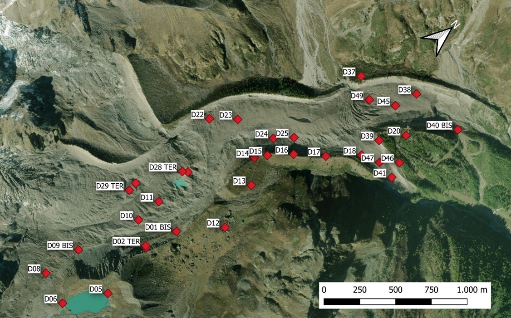
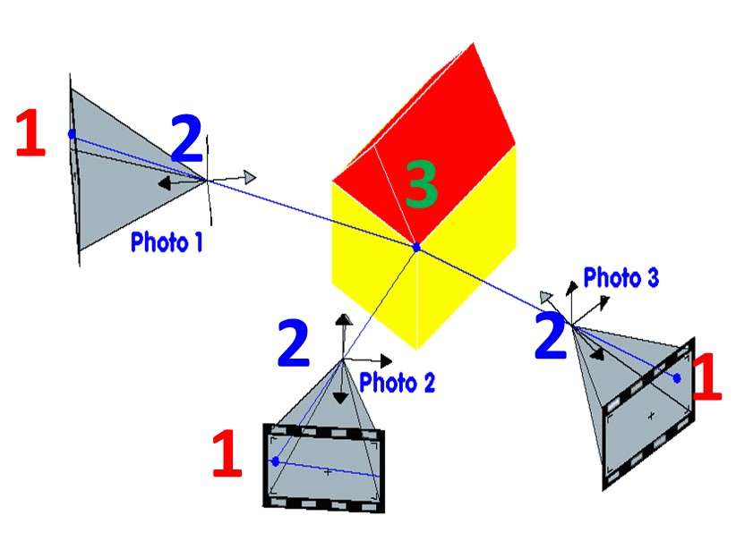
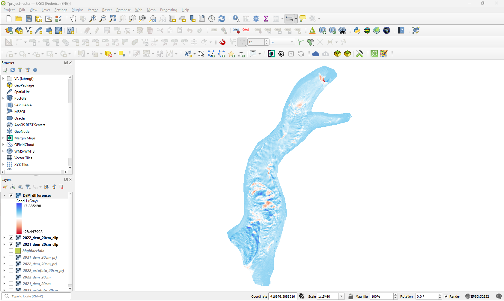

# Belvedere Summer School Learning Material

A repository for documentation and sharing of learning material produced as part of the 10th edition of the Summer School "**_Design and Implementation of Topographic Surveys for Territorial Monitoring in Mountain Environments_**", organized by the Section of Geodesy and Geomatics of the Department of Civil and Environmental Engineering (DICA), Politecnico di Milano.

## Course website

You can visit the course website at this [https://tars4815.github.io/belvedere-summer-school/](https://tars4815.github.io/belvedere-summer-school/)

## Contents

<table>
    <tr>
        <td style="padding: 0px; text-align: center"><b>Module 1</b>
        </td>
        <td style="padding: 0px; text-align: center"><b>Module 2</b>
        </td>
        <td style="padding: 0px; text-align: center"><b>Module 3</b>
        </td>
    </tr>
    <tr>
        <td style="padding: 0px; text-align: center">Description of the <b>monitoring activity</b> carried out on the Belvedere Glacier with UAV photogrammetry and GNSS.
        </td>
        <td style="padding: 0px; text-align: center">Introduction to <b>photogrammetry</b> theory concepts and applications.
        </td>
        <td style="padding: 0px; text-align: center">Introduction to <b>GNSS positioning</b>, data acquisition and processing.
        </td>
    </tr>
    <tr>
        <td style="padding: 0px">
			
		</td>
        <td style="padding: 0px">
			
		</td>
        <td style="padding: 0px">
			
		</td>
    <tr>
    <tr>
        <td style="padding: 0px; text-align: center"><b>Module 4</b>
        </td>
        <td style="padding: 0px; text-align: center"><b>Module 5</b>
        </td>
        <td style="padding: 0px; text-align: center"><b>Module 6</b>
        </td>
    </tr>
    <tr>
        <td style="padding: 0px; text-align: center">Introduction to <b>Geographic Information System</b> and spatial data analysis
        </td>
        <td style="padding: 0px; text-align: center">Introduction on the stereo processing from <b>fixed-time-lapse cameras</b>.
        </td>
        <td style="padding: 0px; text-align: center">Overview of the basics for <b>3D data sharing</b> and visualisation on web.
        </td>
    </tr>
    <tr>
        <td style="padding: 0px">
			
		</td>
        <td style="padding: 0px">
			
		</td>
        <td style="padding: 0px">
			
		</td>
    <tr>
</table>

## Open Data

The data processed and finalised within the summer school and the Belvedere glacier monitoring project are openly available on Zenodo under a GNU GPL v.3.0. license.

## Acknowledgements

The teaching material of the Belvedere glacier summer school collected on this openly accessible website has been prepared by members of the LabMGF of the Department of Civil and Environmental Engineering of Politecnico di Milano under the coordination of professor Livio Pinto:

- Federico Barbieri, research fellow
- Rebecca Fascia, PhD candidate
- Federica Gaspari, PhD candidate
- Francesco Ioli, PhD candidate
- Lorenzo Rossi, permanent research fellow

## References

- Gaspari, F., Ioli, F., Barbieri, F., Bonora, S., Fascia, R., Pinto, L., and Migliaccio, F. (2024) **Bridging geomatics theory to real-world applications in alpine surveys through an innovative summer school teaching program**, *Int. Arch. Photogramm. Remote Sens. Spatial Inf. Sci.*, XLVIII-4/W12-2024, 59–66, https://doi.org/10.5194/isprs-archives-XLVIII-4-W12-2024-59-2024 

- Gaspari, F., Ioli, F., Barbieri, F., Fascia, R., Pinto, L., and Rossi, L.: **From theory to real-world geomatics applications: glacier monitoring fieldworks through an innovative teaching program**, \*, Vienna, Austria, 14–19 Apr 2024, EGU24-16189, https://doi.org/10.5194/egusphere-egu24-16189, 2024

- Gaspari, F., Barbieri, F., Fascia, R., Ioli, F., Pinto, L., and Migliaccio, F. (2025) **Strategies for Glacier Retreat Communication with 3D Geovisualization and Open Data Sharing**, *ISPRS Int. J. Geo-Inf.*, 14, 75, https://doi.org/10.3390/ijgi14020075 
