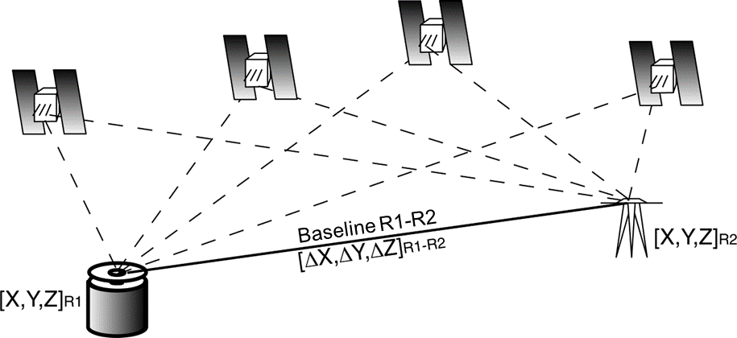

# Belvedere Summer School Learning Material

A repository for documentation and sharing of learning material produced as part of the 10th edition of the Summer School "**_Design and Implementation of Topographic Surveys for Territorial Monitoring in Mountain Environments_**", organized by the Section of Geodesy and Geomatics of the Department of Civil and Environmental Engineering (DICA), Politecnico di Milano.

## Course website

You can visit the course website at this [https://tars4815.github.io/belvedere-summer-school/](https://tars4815.github.io/belvedere-summer-school/)

## Contents

<table>
    <tr>
        <td style="padding: 0px; text-align: center"><b>Module 1</b>
        </td>
        <td style="padding: 0px; text-align: center"><b>Module 2</b>
        </td>
        <td style="padding: 0px; text-align: center"><b>Module 3</b>
        </td>
    </tr>
    <tr>
        <td style="padding: 0px; text-align: center">Description of the monitoring activity carried out on the Belvedere Glacier with UAV photogrammetry and GNSS.
        </td>
        <td style="padding: 0px; text-align: center">Introduction to photogrammetry theory concepts and applications.
        </td>
        <td style="padding: 0px; text-align: center">Introduction to GNSS positioning, data acquisition and processing.
        </td>
    </tr>
    <tr>
        <td style="padding: 0px">
			
		</td>
        <td style="padding: 0px">
			
		</td>
        <td style="padding: 0px">
			
		</td>
    <tr>
</table>

1. **[Introduction](https://tars4815.github.io/belvedere-summer-school/introduction/)**: This module gives a brief introduction to the course, providing a general overview of the summer school and the main topics covered during the course.

5. **[Module 4](https://tars4815.github.io/belvedere-summer-school/module4/module4/)**: this module gives an introduction to GIS and spatial data analysis.

6. **[Module 5](https://tars4815.github.io/belvedere-summer-school/module5/module5/)**: this modules gives an introduction on the stereo processing from fixed-time-lapse cameras.

7. **[Module 6](https://tars4815.github.io/belvedere-summer-school/module6/module6/)**: this modules provides the basics for 3D data sharing and visualisation on web

8. **[Belvedere Open Data](https://tars4815.github.io/belvedere-summer-school/data/)**: this module describes the open data collected during the summer school.

9. **[Credits](https://tars4815.github.io/belvedere-summer-school/credits/)**: this module describe in details the individual contributions of the developers team.

10. **[References](https://tars4815.github.io/belvedere-summer-school/references/)**: this module provides a list of references used during the summer school.

## Acknowledgements

The teaching material of the Belvedere glacier summer school collected on this openly accessible website has been prepared by members of the LabMGF of the Department of Civil and Environmental Engineering of Politecnico di Milano under the coordination of professor Livio Pinto:

- Federico Barbieri, research fellow
- Rebecca Fascia, PhD candidate
- Federica Gaspari, PhD candidate
- Francesco Ioli, PhD candidate
- Lorenzo Rossi, permanent research fellow

## References

- Gaspari, F., Ioli, F., Barbieri, F., Fascia, R., Pinto, L., and Rossi, L.: **From theory to real-world geomatics applications: glacier monitoring fieldworks through an innovative teaching program**, \*, Vienna, Austria, 14–19 Apr 2024, EGU24-16189, https://doi.org/10.5194/egusphere-egu24-16189, 2024
