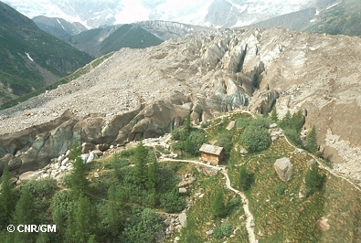
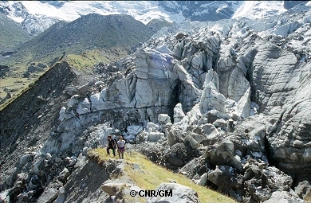
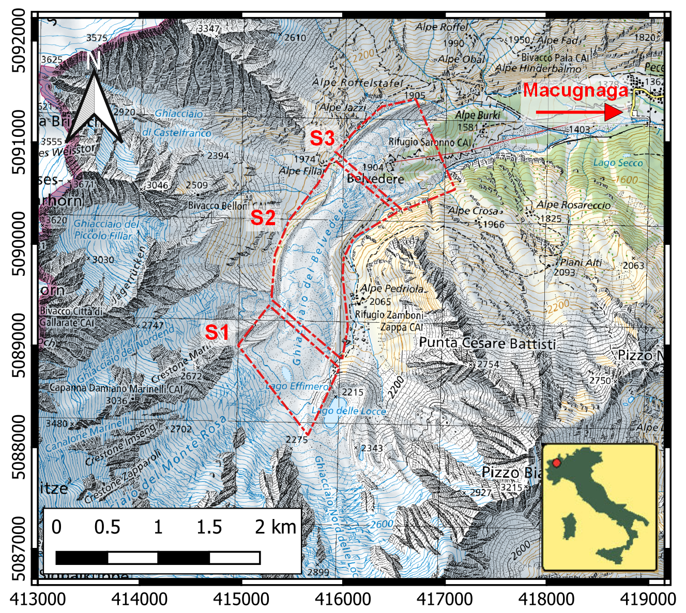

# Belvedere

This module introduce the Belvedere Glacier.

## Table of contents

1. [The Belvedere Glacier](#the-belvedere-glacier): a brief description of the Belvedere Glacier.

2. [Glacier Hazards and surge event of 2001-2002](#glacier-hazards-and-surge-event-of-2001-2002): a brief description of the glacier hazards and the surge event of 2001-2002.

3. [Main morphological sectors](#main-morphological-sectors): a brief description of the main morphological sectors of the Belvedere Glacier.

## The Belvedere Glacier

The Belvedere Glacier (Randolph Glacier Inventory code RGI60-11.02858) is an alpine glacier in Valle Anzasca (Italy), on the east side of the Monte Rosa Massif (located at approximately 45◦ 58’ N 7◦ 55’ E) (Fig. 1a). The lower part of the Belvedere Glacier is a temperate debris-covered glacier, that covers an area of ∼1.8 km2 and extends from an altitude of ∼2250 m a.s.l. to ∼1800 m a.s.l.
This region is characterized by a gentle slope, and it is fed by ice falls and snow avalanches coming from the Monte Rosa East Face.
It covers an area of ∼1.8 km2 and it is mainly elongated in South-North direction, with a length of ∼3000 m and a maximum width of only ∼500 m. Similarly to Miage glacier (Monte Bianco, Valle d’Aosta), the Belvedere Glacier is almost completely covered by rocks and debris.
In its low-relief sector, the Belvedere Glacier splits into two lobes. The two glacier lobes reach ∼1800 m a.s.l. The northern lobe ends with a prominent ice cliff, from which the River Anza springs.
Except from the terminal ice cliff, the glacier tongue is completely covered by rocks and boulders with dimensions ranging from few decimetres to some meters.

_Figure 1: Location of Belvedere Glacier (base map source: [Swiss Federal Office of Topography](https://www.geo.admin.ch));_

## Glacier Hazards and surge event of 2001-2002

In the past, several hazardous events originated by Belvedere Glacier, such as floods and slope instability, threatened the nearby village of Macugnaga and the Zamboni Zappa Hut, at 2070 m a.s.l. ([Kääb et al., 2004](./references.md)). At the beginning of the 21st century, the Belvedere Glacier was characterized by a particular surge-type dynamics (Haeberli et al., 2002): a wave of compression-decompression stresses was generated by an accelerated ice flow derived from the glacier accumulation area. Surface velocities reached up to 200 m y−1 ([Kääb et al., 2004](./references.md)) and the ice thickness increased more than 20 m. A more detailed description of the characteristics of the Belvedere Glacier and the glacier-related hazards can be found in previous studies, such as ([Ioli et al., 2022; Kääb et al., 2004; Haeberli et al., 2002](./references.md)).

  
_Figure 2: The bifurcation of the frontal tongue of Belvedere Glacier: the mighty swelling of the glacier mass is clearly visible (photo G. Mortara, 21.06.2002);_

  
_Figure 3: Right lateral moraine, early October 2001. Note the increase in thickness and the invasion by ice (in the foreground) of the breccia on the right moraine (effect of the Locce glacial lake rout, which occurred on July 19, 1979) (photo G. Mortara, October 2001);_

## Main morphological sectors

From the morphological point of view, the Belvedere Glacier can be roughly divided into three sectors:

- **Upper sector (labelled as S1 in Fig. 4):**
  it consists of the accumulation zone. It is located at about 2250 m a.s.l., at the feet of the steep Monte Rosa and the North Locce Glaciers, from which recurrent ice and snow avalanches feed the Belvedere Glacier. This sector is also the main deposition area for rocks and debris ([Diolaiuti et al.,, 2003; Molg et al., 2020](./references.md)).

- **Central sector (S2 in Fig. 4):**
  it is the transfer zone and it is enclosed by two sinuous moraines. It starts from an altitude of ∼2250 m a.s.l. and it extends downwards for ∼1500 m. This sector shows the highest ice flow velocities and the most irregular surfaces, with the presence of several crevasses.

- **Lower sector (S3 in Fig. 4):**
  it is the low relief sector. Here, in proximity of the Belvedere hill, the glacier splits in two different tongues: the north-west tongue is the largest and it reaches the lowest altitude of about 1800 m a.s.l. From the north-west tongue, the Anza River springs. A smaller tongue extends from the Belvedere hill towards East and reaches an altitude of about 1850 m a.s.l.

  
_Figure 4: Location of the Belvedere Glacier with superimposed the three main morphological sectors: sector 1 (S1) is the accumulation zone, sector 2 (S2) is the transfer zone, sector 3 (S3) is the low-relief zone with the two glacier tongues. Coordinates are framed in ETRF2000(2008)—UTM 32N. [Basemap source: Swisstopo (geo.admin.ch) ]._
