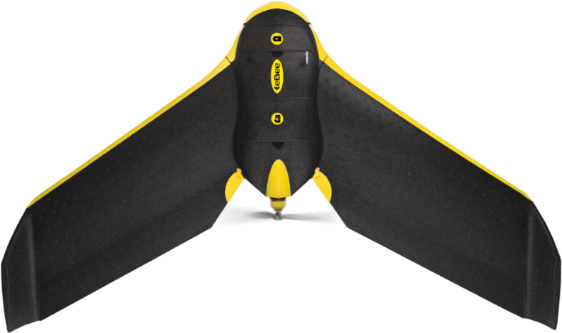
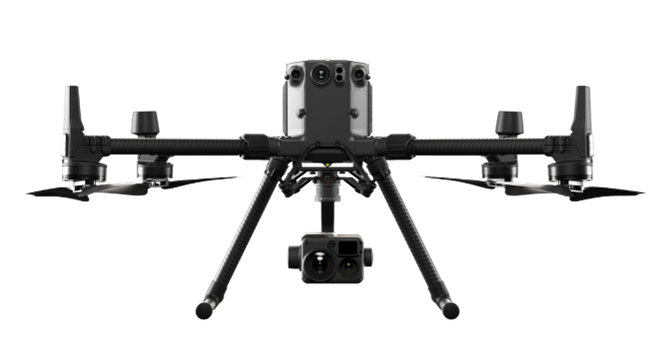
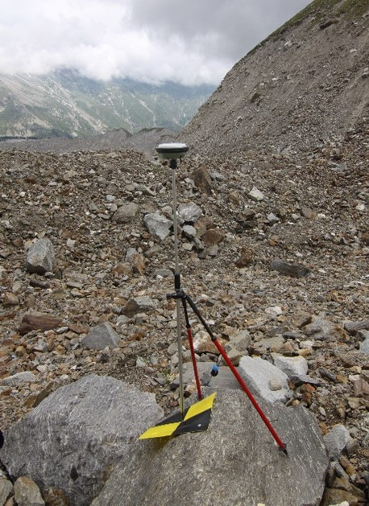
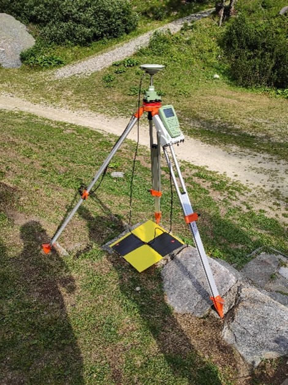

# Instrumental techniques

Surveying activities are based on two measurement techniques: UAV (Unmanned Aerial Vehicles) photogrammetry and GNSS (Global Navigation Satellite System) surveying. 

## UAV Photogrammetry

UAV photogrammetry involves using drone aerial images to create a three-dimensional model of the terrain. To ensure accurate results, the images must meet specific criteria such as having sufficient overlaps and being taken at a precise altitude relative to the terrain. Further details on these criteria will be addressed in Module 2. 

As a recent technique, this field is advancing rapidly with varied technological developments over time. Specifically, in Belvedere surveys there has been a transition from fixed-wing drones (showing higher flight autonomy but lesser carrying capability) to multi-copter drones (capable of carrying more weight and thus improved sensors).

## GNSS Survey

Precision GNSS measurement in high mountain environments involves seeveral issues that must be considered, in order to achieve optimal accuracy (sub-decimetre level). These aspects will be dealt with in more detail in Module 3 of the course. In any case, it is essential to use high-precision GNSS instrumentation. Depending on the measurement mode, it may be sufficient to use a single receiver (rover) or a two-receiver system (base, stationary on one point, and rover that moves).

GNSS receivers are used to periodically acquire the position of a series of points distributed all over the area. During the first measurement campaign (year 2015) this point network was designed and materialised, trying to distribute them completely and uniformly, both inside and outside the glacier. These points in fact perform two very important functions: the first is to act as georeferencing and control points for the photogrammetric models, while the second is to obtain information on the surface displacements of the glacier, through several measurements of the same point at different years. The points are materialised by plastic chequerboard targets, permanently fixed to the ground on large boulders. Their arrangement was decided bearing in mind the visibility of the marker from the drone, the accessibility of their position and the ease of finding the points in future campaigns. Due to the severe weather and atmospheric conditions to which they are subjected, each year each marker is checked, and replaced if it is too worn.

