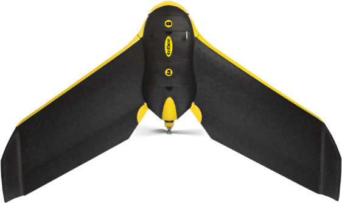

# Belvedere Glacier Monitoring Campaigns

Starting from the year 2015, several research teams from the Alta Scuola Politecnica (ASP Politecnico di Milano and Politecnico di Torino), and from Department of Civil and Environmental Engineering (DICA, Politecnico di Milano), have annually conducted UAV surveys over the entire Belvedere glacier with the aim of creating three-dimensional models. Comparing these models would then allow for the estimation of annual changes in the glacier's surface and the surrounding terrain. Over the years, the equipment used has changed and evolved, consequently altering the methods and outcomes of the surveys. In the following paragraphs, a summary will be provided with the main characteristics of each measurement campaign.

## 2015

The 2015 campaign flight was carried out by the DREAM1 Team of the Alta Scuola Politecnica (ASP) during the month of October using the eBee SenseFly professional fixed-wing drone. The camera mounted on board had the following characteristics:

| Model      | Focal length | Image dimension | 
| ----------- | ----------- | ----------- |
| Canon PowerShot S110 | 5,2 [mm] | 4048x3048 [pixel]|

The model was composed from 2118 images. The average resolution (ground pixel size) was 7 cm and the final model accuracy was about 11.5 cm.

## 2016

In 2016, the ASP DREAM2 Team was in charge of the Belvedere Glacier measurement campaigns.  The flight dates back to 20 October 2016, carried out with the same fixed-wing drone used during the 2015 campaign: eBee SenseFly, with the same Canon PowerShot S110 camera on board. The model was composed from 1085 images. The average ground resolution was 9 cm and the final accuracy 11 cm.

## 2017

The 2017 campaign was characterised by 3 different surveys, carried out by the ASP DREAM3 Team. The flights were carried out during the months of October and November: 

1. **2017, October 5th**: SenseFly eBee fixed-wing drone equipped with Canon PowerShot S110 camera; 

2. **2017, November 15th**: SenseFly eBee plus PPK fixed-wing drone equipped with SenseFly S.O.D.A camera with the following characteristics:

| Model      | Focal length | Image dimension | 
| ----------- | ----------- | ----------- |
| SenseFly S.O.D.A. | 10.2 [mm] | 5472x3648 [pixel]|

This drone, compared to the previously used standard eBee, is equipped with a precision GNSS system, which allows for accurate georeferencing of image locations. 

3. **2017, November 16th**: DJI Phantom 4 Pro quadricopter drone, with integrated DJI FC6310 camera:

| Model      | Focal length | Image dimension | 
| ----------- | ----------- | ----------- |
| DJI FC6310 | 8.8 [mm] | 5472x3648 [pixel] |

The photogrammetric models obtained were then merged, reconstructing the entire glacier. The complete model was composed from 1221 images. The average ground resolution was 5.3 cm and the final accuracy 5.5 cm.

## 2018

Since 2018, the measurement campaigns have all been carried out by the DICA summer school of the Politecnico di Milano, which always takes place at the end of July. For the 2018 campaign, the Parrot Disco FPV fixed-wing drone was used.  This drone, which is no longer in production, was marketed for recreational purposes. However, thanks to some modifications developed by the DICA staff, it was possible to make it effective for photogrammetric purposes. In fact,  through the necessary modifications, a housing was created inside that allowed the HawkEye FireFly 8S action cam to be mounted. 

| Model      | Focal length | Image dimension | 
| ----------- | ----------- | ----------- |
| HawkEye FireFly 8S | 3.8 [mm] | 4608x3456 [pixel] |

The compact size and low weight of this camera make it an ideal choice despite its lower quality respect to the previous ones. Nevertheless, the model's quality is consistent with that of previous years. The model was created using 1421 images, with an average ground resolution of 5.4 cm and a final accuracy of 3.5 cm.

## 2019

For the 2019 survey, the same setup as in 2018 (Parrot Disco PSV drone, HawkEye FireFly 8S camera) was used. The drone, camera, and frame acquisition and orientation methods remain the same as the previous year. The model was composed from 1442 images, reaching an average ground resolution of 5.7cm, and final accuracy of 3.8 cm. 

## 2020

During the 2020 expedition, the identical drone from previous years was deployed (Parrot Disco PSV equipped with HawkEye FireFly 8S). Nevertheless, operational difficulties were encountered due to camera damage, which resulted in capturing corrupted images of the glacier’s upper section. Subsequently, a DJI Phantom 4 Pro flight was executed over the upper region 15 days later. The georeferencing of this survey presented several challenges, as the glacier surface had shifted significantly in the intervening 15 days since the GNSS measurements were taken. Consequently, it was deemed necessary to create separate models for the upper and lower parts. The low-part model comprises of 725 images, with an average resolution of 5.4 cm and accuracy of 10.5 cm. The upper-part model consists of 729 images, with a resolution of 5 cm and accuracy of 18 cm.

## 2021

In the year 2021, the vehicle was changed once again: a DJI Matrice 210, a professional multi-rotor drone equipped with the DJI Zenmuse X5 camera, was used. The drone also featured a precision GNSS system, built by DICA staff, which was able to provide the position of the images at the times of the shooting.

| Model      | Focal length | Image dimension | 
| ----------- | ----------- | ----------- |
| DJI Zenmuse X5 | 15 [mm] | 5280 x 3956 [pixel] |

1473 images were taken, the average resolution obtained was 3.7 cm and the error obtained was 10 cm.

## 2022

In 2022, the drone with which the survey was carried out was further renewed: the DJI Matrice 300, an advanced version of the 210, was used. The new features are a better quality camera (DJI Zenmuse P1) and a directly embedded GNSS system capable of correcting camera positions in real time.

| Model      | Focal length | Image dimension | 
| ----------- | ----------- | ----------- |
| DJI Zenmuse X5 | 35 [mm] | 8192×5460 [pixel] |

2469 images were taken, the average resolution obtained was 2.7 cm and the error obtained was 11.5 cm.

## UAV Surveys Summary

The table below summarizes all UAV campaigns and their main features.

| YEAR | PERIOD | UAS | CAMERA | AUTHOR | NUMBER OF IMAGES | ACCURACY [cm] |
| ----------- | ----------- | ----------- | ----------- |----------- |----------- |----------- |
| 2015 | October | Ebee SenseFly | Canon PowerShot S110 | ASP | 2118 | 11.5 |
| 2016 | October | Ebee SenseFly | Canon PowerShot S110 | ASP | 1085 | 11 |
| 2017 | October-November | Ebee SenseFly, *Ebee SenseFly plus PPK*, DJI Phantom 4 Pro  | Canon PowerShot S110 *SenseFly S.O.D.A* DJI FC6310  | ASP | 1221 | 5.5 |
| 2018 | July | Parrot Disco | HawkEye FireFly 8S | Summer School DICA | 1421 | 3.5 |
| 2019 | July | Parrot Disco | HawkEye FireFly 8S | Summer School DICA | 1442 | 3.8 |
| 2020 | July-August | Parrot Disco, DJI Phantom 4 Pro | HawkEye FireFly 8S, DJI FC6310 | Summer School DICA | 1473 | 10.5 (low area), 18.8 (high area) |
| 2021 | July | DJI Matrice 210 | Dji Zenmuse X5 | Summer School DICA | 1473 | 9.9 |
| 2022 | July | DJI Matrice 300 RTK | Dji Zenmuse P1 | Summer School DICA | 2469 | 11.5 |
