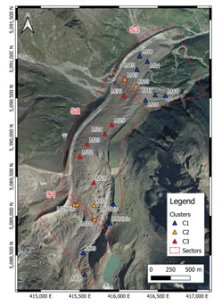
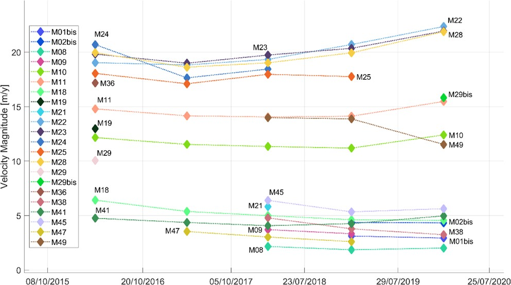
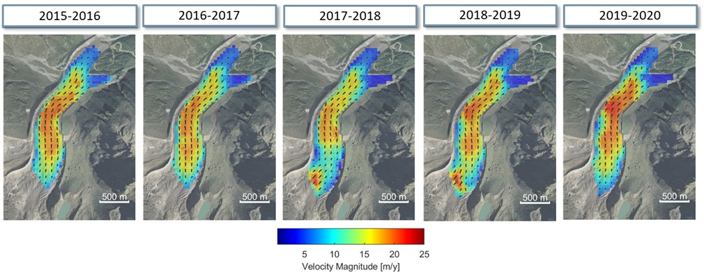
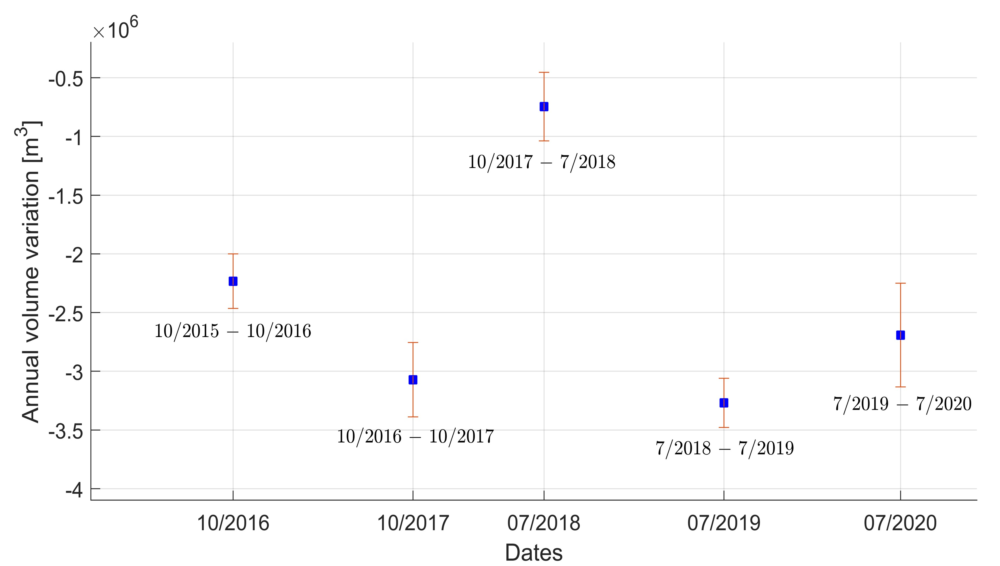
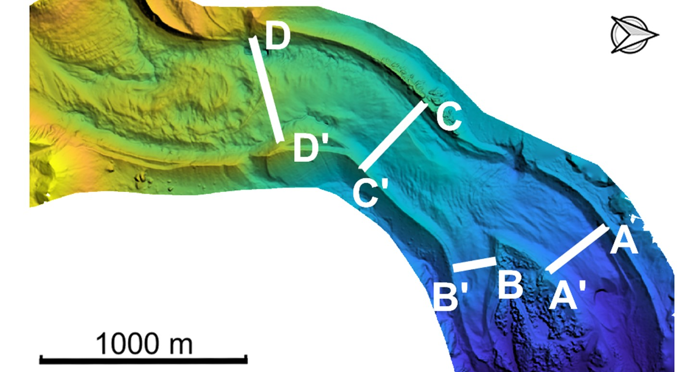
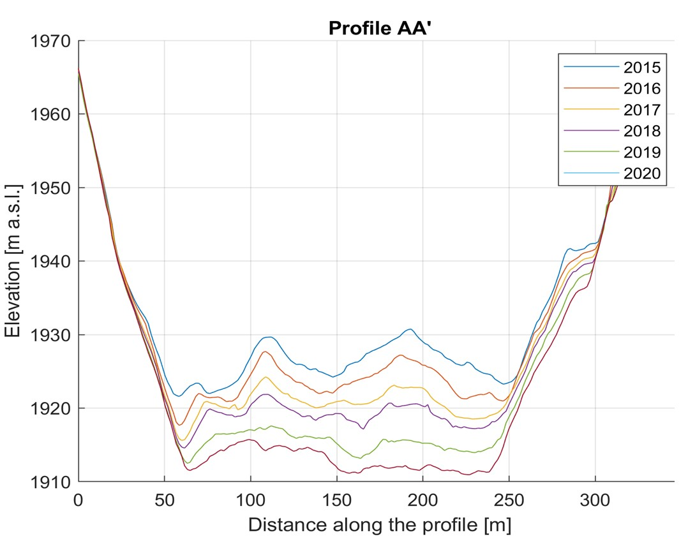
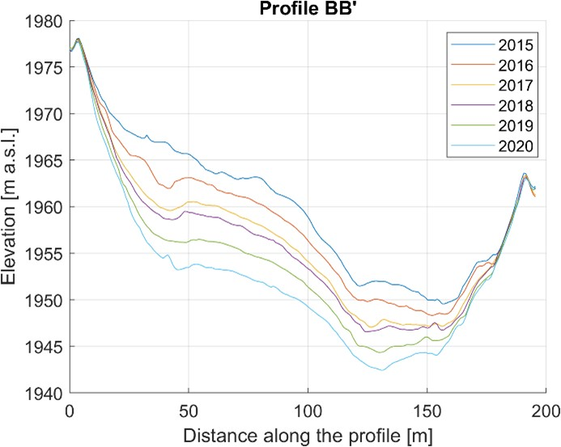
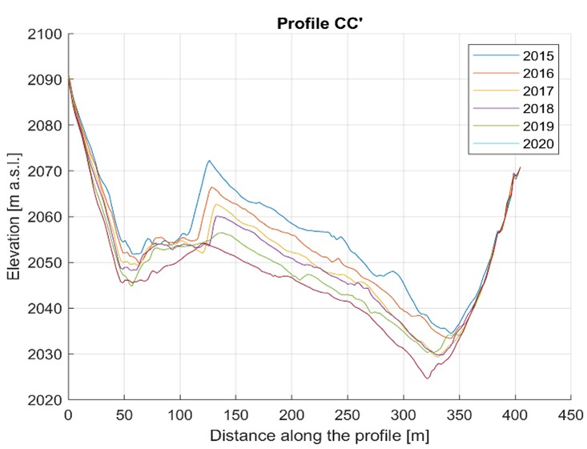
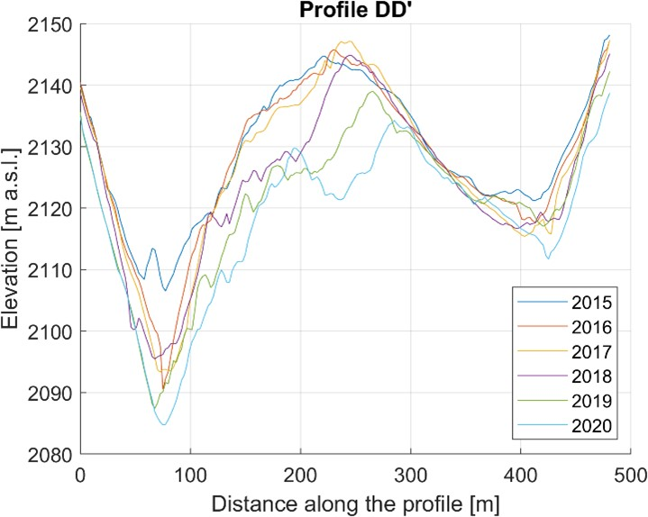

# Monitoring Campaign Results

This chapter will briefly describe the results derived from comparing three-dimensional models of successive surveys in terms of morphological changes of the glacier surface.  

In particular, these changes will be described in terms of surface velocity field and volumetric variation.

## Surface Velocity Field

A glacier is not a stationary object, but behaves like a very viscous fluid that moves slowly under gravity effect. The entity of this movement depends on many factors, such as the slope of the bedrock, the presence of water beneath the ice surface and the temperature. These phenomena and their interactions can be very complex and are still being studied by glaciologists. Reliable and repeated morphological data over time are therefore essential for a better interpretation of these dynamics. 

On Belvedere Glacier, the combination of GNSS and photogrammetric data allowed the estimation of surface velocity fields and their variation during the monitoring period. Two different datasets were used for this purpose:

1. **GNSS points**: These are the points measured annually inside the glacier, the same points used as ground control points in the photogrammetric processing. By calculating the annual displacement of the targets and dividing it by the time period, it was possible to obtain the annual velocity of each target. These measurements are very reliable (centimetre accuracy). They were therefore considered as a reference source for the estimation of flow velocity.

2. **Manual Points**: The number of GNSS points is not sufficient to estimate a complete glacier velocity field. Therefore, orthophotos derived from photogrammetric models were used to identify certain characteristic points (such as boulder edges on the glacier surface). An orthophoto is a rectified and georeferenced image, which makes it effectively a cartography, as will be explained in more detail in Module 2 of this course. It was therefore possible to assess the degradation at a greater number of points, even though with less reliability than GNSS points.

All points contributed to a comprehensive estimate of the glacier's velocity fields. The results showed velocities between 2 m/y and 22 m/y for the period 2015-2020. Three distinct sectors can be identified:  

1. **Upstream zone**: corresponds to the accumulation zone and is characterised by velocities between 2 and 15 m/y; 

2. **Central zone**: this is the zone with the highest velocities (15-22 m/y). Since 2018, there seems to be a further acceleration in this area compared to previous years. 

3. **Tongue zone**: slower speeds, never exceeding 10 m/y.

## Volume Variation

One of the most known effects of climate change is glaciers reduction. Belvedere is no exception, as the thermal insulation provided by debris cover is not sufficient to preserve the ice from melting. By comparing DTMs (Digital Terrain Models, obtained from photogrammetric surveys, Module 2), it is possible to quantify annual volumetric changes. The figure below shows the year-by-year changes with their uncertainties. It can be seen that in the period of the analysis, the volume loss over the entire glacier was about 3 million of m3 per year. The year 2107-2018 seems much lower than the others, but this depends on the surveys period: 2017 survey was carried out in November, while the 2018 one in July: in this way, the melt of summer 2017 was not considered and therefore the overall melt results lower than the average.

For the purpose of assessing the variation in ice thickness, comparisons of several characteristic cross sections of the glacier in different years were made. In each profile, the ice section is clearly recognizable, as it is sunken between the lateral moraines. The greatest reductions in thickness (about 2 m/y) are observed on sections AA' and BB', at the terminal tongues. In these sections, the profile shape remains almost constant.  In the central part of the glacier (sections CC' and DD'), the ice reduction is less regular, due to the numerous crevasses in this area, but it’s always about 1 m/y.

