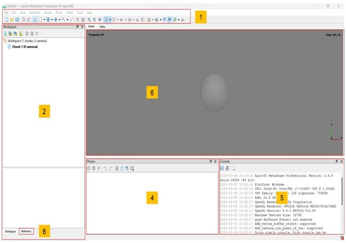

# Introduction to Agisoft Metashape

## What is Agisoft Metashape?

**Agisoft Metashape** is a stand-alone software product that processes digital images (aerial and close-up) through photogrammetry to generate 3D spatial data. The data is suitable for use in a range of applications such as GIS, cultural heritage documentation, visual effects production, and indirect measurement of objects of varying scales. The technology also enables the integration of laser scans and the seamless fusion of LiDAR and camera data within a single project. The software then allows images to be processed from RGB to spatial information in the form of point clouds, textured polygonal models and DEM.

## What are the input and output data?

**Input data**

* **Photos**: in the practical case they were taken by drone flight; these photos are also geolocated due to the GNSS system on board the drone.

* **Camera Calibration**.

* **GPS coordinates** of known fixed points, called Ground Control Points (GCP). 

**Output data**

* **Dense cloud** 

* **Mesh** 

* **DTM**  

* **Orthophoto**

## Graphic User Interface

The GUI of Agisoft Metashape Desktop is mainly composed of: 

1. **Toolbar**: this is the main menu, where you can find all the necessary commands. 

2. **Workspace panel**: this section presents all the components and results that make up this project. 

3. **Reference panel**: this section presents all the technical components that make up this project. 

4. **Photo view**: the selected photographs for the project are on display here. 

5. **Console**: in this section, users can access the command history, auxiliary information, and error messages. 

6. **Model view**: it is where 3D data are displayed and for editing meshes and point clouds.

