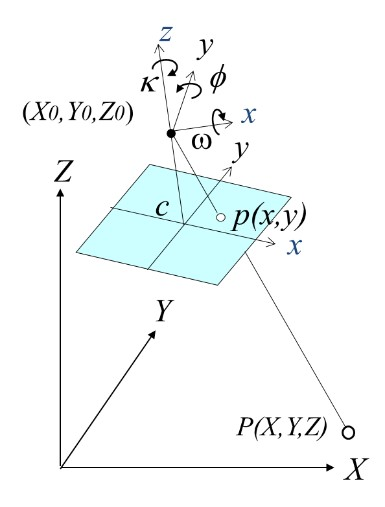
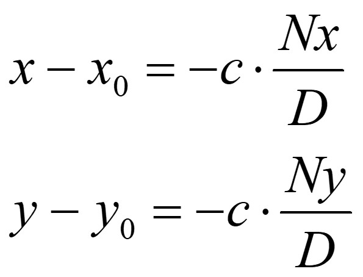
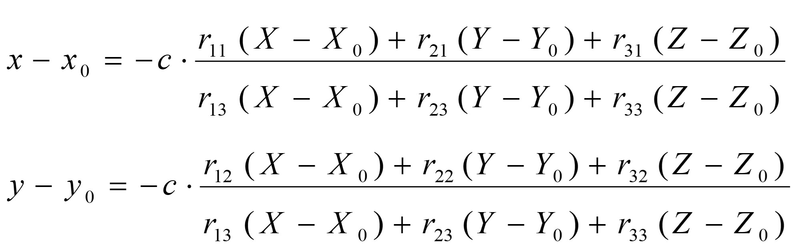
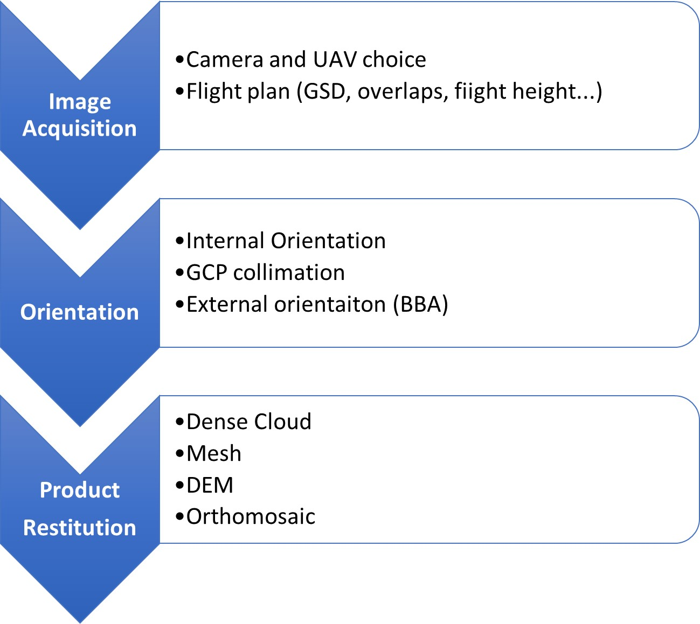
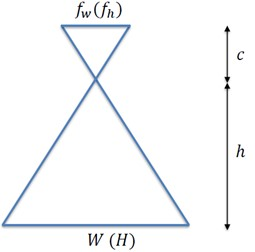
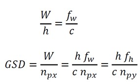
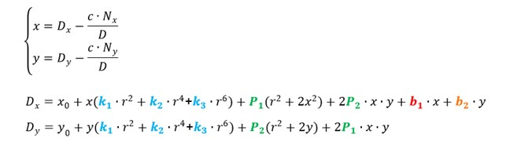
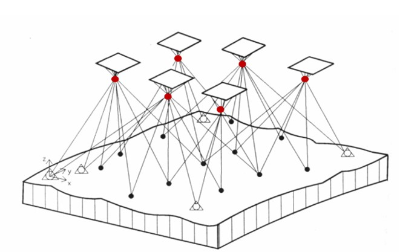
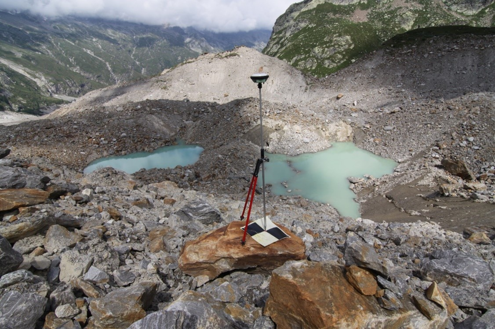

# Introduction to photogrammetry

## What is photogrammetry? 

**Photogrammetry** is a technique that allows the reconstruction of three-dimensional objects from images, both in terms of geometry and metric position.  

This technique is used for: 

1. Production and updating of cartography; 

2. Production of Digital Elevation Models; 

3. 3D modelling; 

4. Terrestrial photogrammetry (architectural surveys).

## Geometrical Principles of Photogrammetry

Photogrammetry is theoretically based on the principle of collinearity, which is the relationship between:

1. **Image point**

2. **Acquisition point**

3. **Object point**

In other words, it is possible to mathematically describe an optical ray joining these three points. This description is called **collinearity equation**.  

Knowing the position and orientation of the images, it is possible to determine the position of the object point in space by intersecting the homologous rays. It is therefore necessary for each point to be visible in at least two images. 

Collinearity equations relate image space (2D) to object space (3D) by modelling:

* Position in image space of the point (*x*, *y*);

* Camera calibration parameters: principal point (*x0*, *y0*), principal distance (*c*) and lens distortion coefficients;

* External camera parameters: position coordinates (*X0*, *Y0*, *Z0*) and rotation angles (*w*, *f*, *k*);

* Coordinates in real space of the homologous point (*X*, *Y*, *Z*).

## The photogrammetric process

A photogrammetric survey consists of a process composed of well-defined steps. Each of these contains several aspects that must be considered account to obtain a good result. The main steps are described in the figure, and will be discussed in more detail later.

### Image acquisition

The acquisition of images should be planned carefully. In territorial surveys, like the Belvedere Glacier one, images are obtained through a series of parallel 'flight strips' in order to cover the whole area of interest. 

The key parameter to set is the **Ground Sample Distance** (GSD), which refers to the size of the pixel footprint on the ground. This parameter is crucial as it indicates the smallest visible detail in the images, directly impacting the accuracy and resolution of the final model.

The GSD is determined by the camera's characteristics (focal length and sensor size) and flight altitude, following this formula:

Where:

* *h*: relative flight height [m] 

* *c*: principal distance [mm] 

* *𝑓𝑤* (𝑓ℎ): sensor size [mm] along width (length) direction 

* *𝑊* (𝐻): image footprint along width (length) [m] 

* *𝑛𝑝𝑥* (𝑛𝑝𝑦): number of pixels along sensor width/length direction

Once the GSD has been set, the overlap between images should be configured, divided into the following: 

* **Longitudinal**: in the direction of the flight path (70-80%)  

* **Transverse**: between two adjacent flight paths (60-70%) 

Additionally, it is important to consider practical factors including terrain features, battery capacity, flight speed, camera shutter speed, and airspace regulations in the relevant area.  Flight planning is currently carried out by specialised software (such as UgCS, DJI Pilot and many others) which can create plans that optimise all the outlined aspects.

### Camera Calibration and Internal Orientation

The process for determining the internal orientation parameters of a camera is called lens calibration. These parameters include the principal distance (*c*), the position of the principal point (*x0*, *y0*), and lens distortion coefficients. Every lens, even the most precise one, produces image deformations. Accurately modelling these deformations is necessary to achieve good results in photogrammetric restitution.  

The most common distortion model is the **Brown’s model**. It is characterized by 10 parameters that represent the different components of the distortion:

* **Radial distortion**: it is modelled by an odd polynomial function. It is the main component (coefficients: K1, K2, K3); 

* **Tangential distortion**: it represents the not exact concentricity of the lens to the optical axis. It is an order of magnitude smaller than the radial distortion (coefficients: P1, P2); 

* **Affine distortion**: it models the fact that the pixel is not exactly a square (coefficient: b1); 

* **Skew distortion**: it models the fact that the pixel can be parallelogram instead of a square (coefficient: b2).

Camera calibration can be performed in two ways:  

* **Laboratory calibration**: Procedure conducted in laboratory employing specialised software and guided systems for acquiring and analysing data;  

* **Self-calibration**: performed in-flight during image processing, with the aim of seeking calibration parameters that maximize the quality of the results on a statistical level.

### External Orienntation

**External orientation** in photogrammetry refers to the determination of the spatial position and orientation of a camera or sensor in relation to the objects being photographed. It involves establishing the exact location (3D coordinates *X0*, *Y0*, *Z0*) and orientation (rotation angles *w*, *f*, *k*) of the camera or sensor at the moment each photograph is taken. This information is crucial for accurately measuring and mapping objects or terrain from the photographs. 

External orientation can be:

* **Relative**: determines the geometric relationships between multiple images taken from different positions and angles, with the goal of obtaining the spatial orientation of these images relative to one another. Therefore, the real position in the object reference system remains unknown. It is based exclusively on the positions of homologous points identified in common between the images and it does not require any external information. 

* **Absolute**: determines the orientation of the block of images directly in the object reference system. It requires some information coming from external sensors (GNSS, IMU) about the position of images or specific measured points (GCP, Ground Control Points) on the object.

Digital photogrammetry makes possible to automate the simultaneous orientation of many images. Software based on **Structure-from-Motion** algorithms, as Metashape,  are able to automatically recognise and match a large number of homologous points (**tie points**) and restore the external orientation of the 'image block'. 

This operation is called **Bundle Block Adjustment** (BBA) and consists of the statistical solution of the system of equations given by the collinearity equations (2 for each tie point per image) and the GCP information's.  

The solution provides estimation values of:

* Object coordinates of tie points; 

* External image orientation; 

* Camera internal orientation (in case of self-calibration)

The large number of equations generates a redundant system, that can be solved by least squares adjustment, to minimize the differences between observations and estimated values.

If feasible, it is possible to use a priori information regarding the external orientation of the drone's cameras, obtained from sensors like GNSS (for positions) and IMU (for angles), in the BBA. This is often the case of Belvedere glacier surveys. 

#### Ground Control Points

Ground Control Points (GCPs) are crucial components for successful photogrammetry, as they enable the assignment of the desired reference system to the survey and the estimation of model errors. These points are measured directly on the area/object of interest using GNSS or classical topographic instruments. 

GCPs should be: 

* **Homogeneously distributed** throughout the area; 

* **Clearly visible** in the images: characteristic details or specially positioned targets;  

* **Measured** at roughly **the same time of flight**, as their position should not change between GNSS measures and flight. 

On Belvedere Glacier, GCPs are materialised by plastic targets with high colour contrast. They are measured annually by GNSS instrumentation on the same days as the drone flights: in fact, the glacier surface where the GCPs are positioned is in continuous motion.

### Restitution

Restitution is the final stage of the photogrammetric process. Using the information from the external orientation, a large number of homologous points can be identified in the images, which will form a dense point cloud of sufficient number and density to reconstruct the object three-dimensionally. The dense cloud can be further processed in order to generate other photogrammetric products, among which are: 

* **Mesh**: Three-dimensional digital surface model of the object surveyed; 

* **DEM**: Digital Elevation Model. Dataset representing surface elevation. It usually consists of a raster dataset, i.e. a matrix of regular cells with each cell having a corresponding elevation value; 

* **Orthomosaic**: A georeferenced and orthorectified image of the surveyed area is produced by projecting the 3D surface (DEM, mesh) onto a specific plane and stitching together the individual images.

