# Metashape Workflow

In Metashape environment, the process of photogrammetry to generate a dense point cloud and associated products comprises several sequential stages as presented below:

1. **Import Images**: Upload images

2. **Camera Calibration**: Set interior orientation

3. **Setting Coordinate Reference System**

4. **Insert GCPs coordinates**: measure GCP on images

5. **Align Photos**: Block formation (external orientation) -> Sparse cloud

6. **Create Dense Cloud**: Dense image matching -> Dense cloud

7. **Create Mesh**: 3D polygonal model

8. **Create DEM**: Generate Digital Elevation Model

9. **Create Orthomosaic**: Orthoimages

10. **Export Results**: Export products and quality report

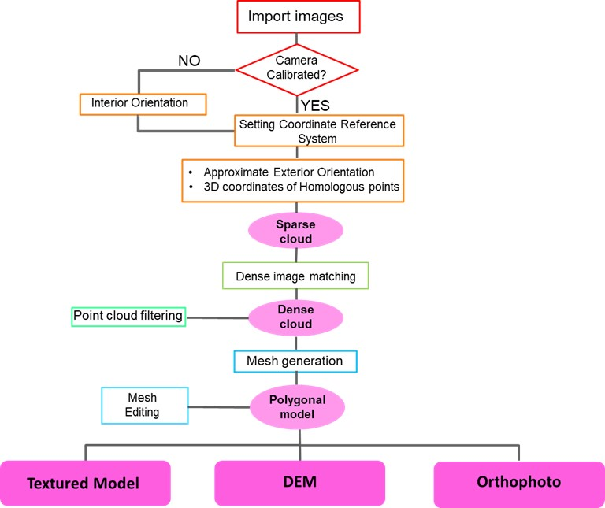

## Import images

The images can be imported directly from the original folder.

Command: **_Workflow → Add Photos_**

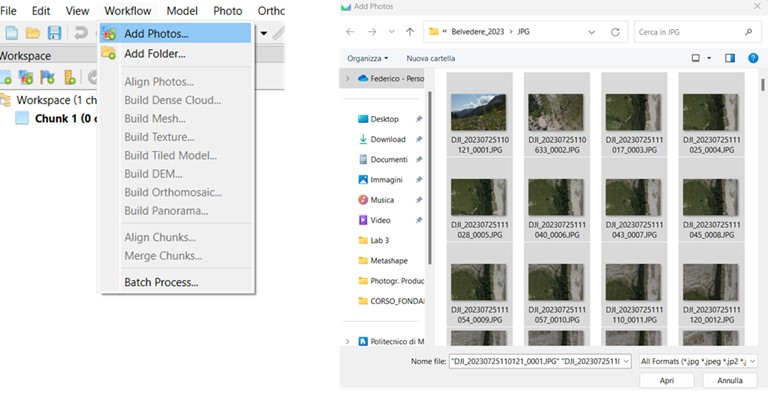

## Camera calibration

If a camera calibration is available, it can be imported before the orientation phase, as a “precalibrated” certificate. During the orientation, the parameters will be re-estimated starting from the original values. It is also possible to fix the coefficients to the initial values. If there is no prior orientation available, the software can carry out an estimation of internal orientation parameters, only based on BBA informations (auto-calibration).

Command: **_Tools → Camera Calibration→ Load a camera certificate_**

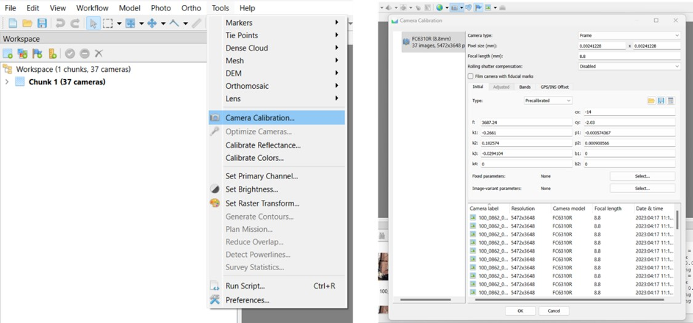

## Setting Coordinate Reference System

It is crucial to assign the appropriate Reference System (RS) for the project, which can be a local coordinate system or a geographic/cartographic system. Metashape can manage different systems separately for cameras, GCPs, and the model. Additionally, it is possible to perform coordinate conversion.

Finally, the Reference panel allows for setting the a priori accuracies of observations.

Command: **_Reference → Settings_**

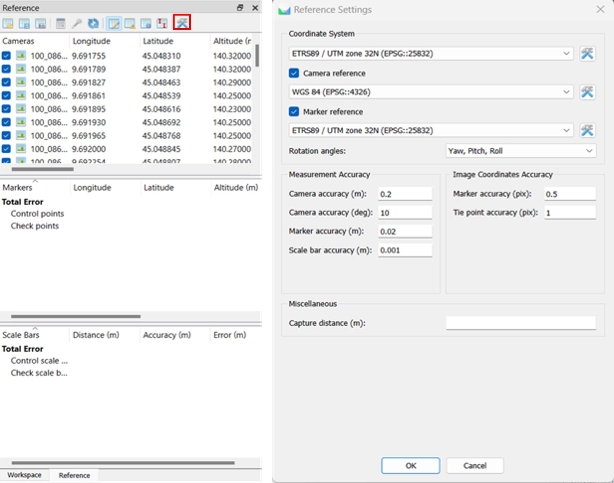

## Insert GCPs coordinates

GCP coordinates, acquired with topographic or GNSS instruments, can be imported from a text file.

Command: **_Reference panel → Import reference_**

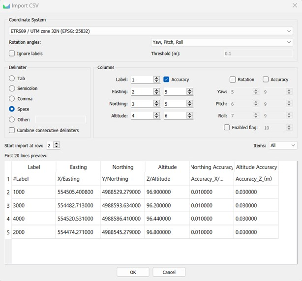

GCPs must be collimated on each image in which they are visible. This operation associates their object coordinates with the corresponding image coordinates, adding these crucial observations to the BBA.

Command: **_Double-click on a photo → Right-click on marker → Place marker_**

## Align photos

This is the actual external orientation phase, in which the BBA is calculated. Many homologous tie points were found by automatic matching, generating the Sparse Cloud.

Command: **_Workflow → Align photos_**

**Parameters** to be set:

_Accuracy_ (image subsample rate):

- **Highest**: pixel oversample 4:1

- **High**: pixel original resolution 1:1

- **Medium**: pixel subsample 1:4

- **Low**: 1:16

- **Lowest**: pixel subsample 1:64

_Reference preselection_ (preferential order in which homologous points are sought in an image pair):

- **Source**: camera positions at shot epochs (if available)

- **Estimated**: estimated camera positions

- **Sequential**: progressive image name/number

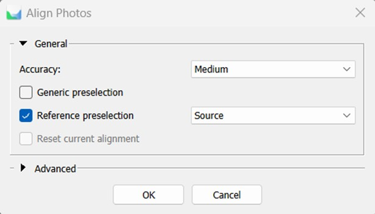

Alignment is the fundamental step in the entire process. in fact, at its end, the quality of the result must be evaluated in terms of residual errors on GCP.

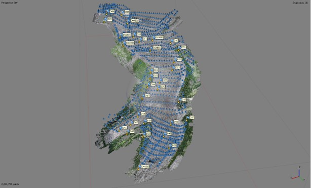

## Create Dense Cloud

Dense cloud is the most complete reconstruction of the object surveyed. It consists of millions of points, whose color and coordinates are known.

Command: **_Workflow → Build Dense Cloud_**

**Parameters** to be set:

_Quality_ (image subsample rate):

- **Ultra High**: original pixel dimension

- **High**: pixel subsample 1:4

- **Medium**: : pixel subsample 1:16

- **Low**: : pixel subsample 1:64

- **Lowest**: : pixel subsample 1:256

_Depht filtering_ (noise point filtering in colud generation phase):

- **Mild**: low smoothing effect

- **Moderate**: intermediate smoothing effect

- **Aggressive**: high smoothing effect

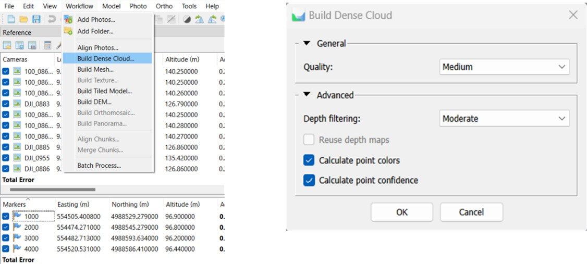

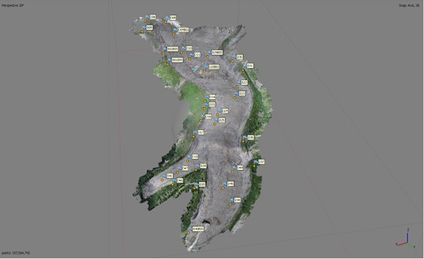

Once computed, the dense cloud can be filtered, subsampled or manually edited.

## Create Mesh

Mesh is a three-dimensional digital surface model of the object surveyed. It is made by the triangulation of the points of the dense cloud.

Command: **_Workflow → Build Mesh_**

**Parameters** to be set:

**Source data** (input dataset):

- _Sparse Cloud_

- _Dense Cloud_

- _Depht Maps_

**Surface type**:

- _Arbitrary_: three-dimensional object

- _Height field_: planar surfaces (terrain)

**Face Count** (faces number):

- _High_: 1/5 respect to cloud numerosity

- _Medium_: 1:15 respect to cloud numerosity

- _Low_: 1:45 respect to cloud numerosity

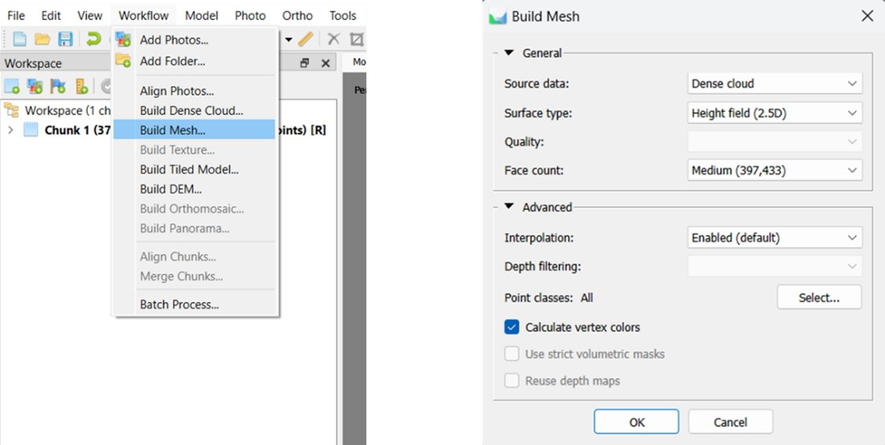

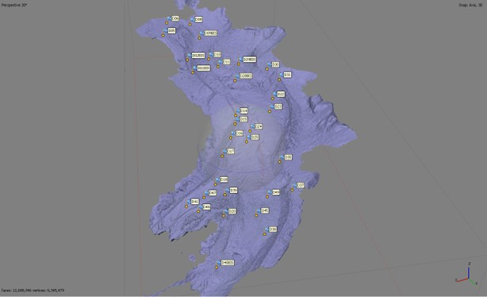

## Create DEM

DEM is a grid file (raster) representing surface elevation. It consists of a matrix of regular cells with each cell having a corresponding elevation value. It is generated by rejecting a 3D input data (point cloud, mesh) on a plane.

Command: **_Workflow → Build DEM_**

**Parameters** to be set:

**Projection**:

- _Geographic_

- _Planar_

- _Cylindrical_

**Source data**:

- _Sparse Cloud_

- _Dense Cloud_

- _Mesh_

**Resolution**: Spatial resolution of the final product (cell size)

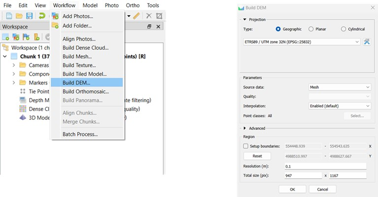

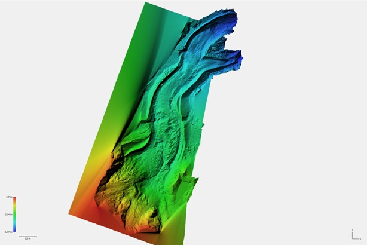

## Create Orthomosaic

A georeferenced and orthorectified image of the surveyed area is produced by projecting the 3D surface (DEM, mesh) onto a specific plane and stitching together the individual images.

Command: **_Workflow → Build Orthomosaic_**

**Parameters** to be set:

**Projection**:

- _Geographic_

- _Planar_

- _Cylindrical_

**Surface**:

- _Mesh_

- _DEM_

- _Disabled_

**Pixel Size**: Spatial resolution final of the product

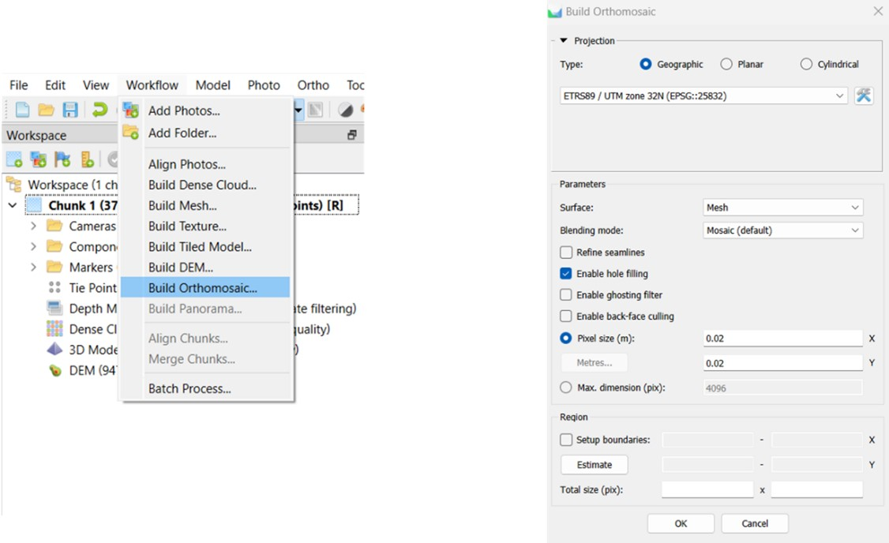

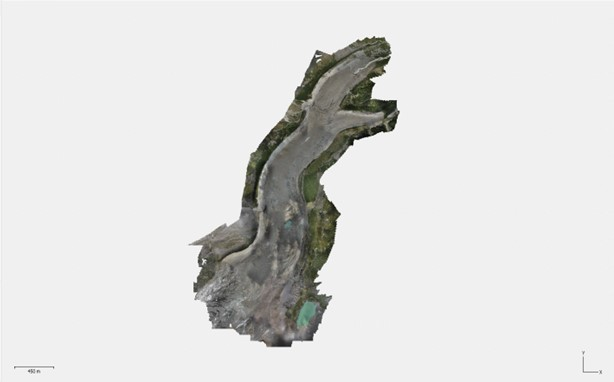

## Export Results

As products are generated, they can be exported outside the Metashape project for use in other software environments. It is also possible to generate the Quality Report, a PDF document in which all the results are reported.

Command: **_File → Export → _**

- **_Export Points_**

- **_Export Mesh_**

- **_Export DEM_**

- **_Export Orthomosaic_**

- **_Generate Report_**

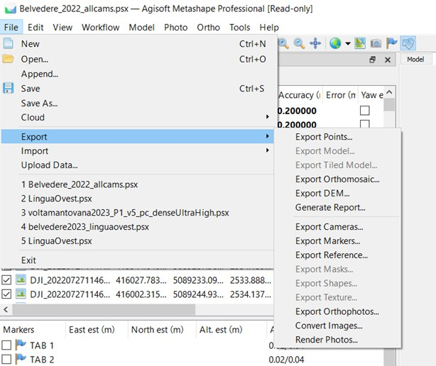

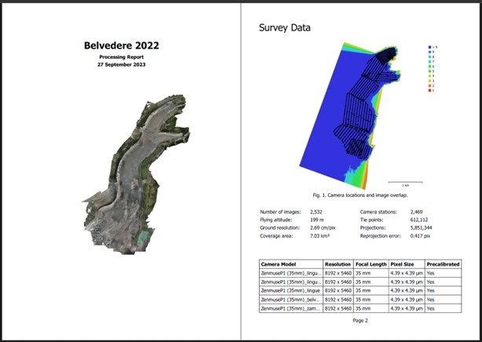
