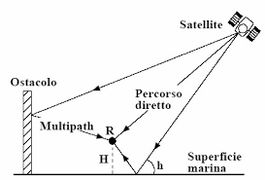
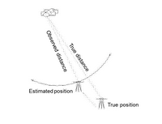
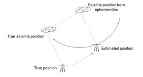
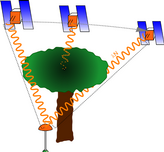

# GNSS signal and observations

Generally, the signal coming from satellites is composed by

- carrier wave (sinusoid)
- a spreading code (a sequence of 0 and 1 bits/chips)
- low-rate navigation data message.

Both the code and navigation message are phase-modulated on the carrier wave. There are more carrier phases on different frequencies on each satellite.

[[image source]](https://www.tudelft.nl/citg/over-faculteit/afdelingen/geoscience-remote-sensing/education/bsc-education/reader-on-gps-positioning)

The spreading code is usually publicly available and is embedded in receivers to properly observe it.
There are two kinds of observations: code observations (pseudo-range) or phase observations.

## Code observations (pseudo-range)

The time shift between the received signal and the receiver internal replica is observed. The observed time Is converted in terms of distance by considering the speed of light (), determining the so-called pseudo-range. This observation has an accuracy in the range 30 cm – 3 m.

Nevertheless, the carrier phase is travelling at a lower speed than the one of light c, due to the presence of troposphere and ionosphere and satellite and receiver clocks are not synchronized with GPS time (and the error of receiver clock is usually larger). Therefore, the pseudo-range observation can be written as

\[ {P}_{R}^{S} = c \, \Delta t = \rho + c \left( d{t}_{R} + d{t}^{S} \right) + {I}_{R}^{S} + {T}_{R}^{S} \]

where $\rho$ is the satellite-receiver distance, $d{t}_{R}$ is the receiver clock error, ${I}_{R}^{S}$ and ${T}_{R}^{S}$ are the ionospheric and tropospheric delay, respectively. $\rho$ is expressed as follows:

\[\rho = \sqrt{{\left({X}^{S} - {X}_{R}\right)}^{2} + {\left({Y}^{S} - {Y}_{R}\right)}^{2} + {\left({Z}^{S} - {Z}_{R}\right)}^{2}}
\]

The unknown of the problem are represented by the coordinates of the receiver ${X}_{R}$, ${Y}_{R}$, ${Z}_{R}$, since the coordinates of the satellites are known from the ephemerides.

## Phase observations

This observation is analogous to the pseudo-range one. However, due to the small wavelength (in the order of 20 cm) also the integer number $N$ of cycles between satellite and receiver must be considered and introduced into the equation.

\[ {L}_{R}^{S} = \rho + c \left( d{t}_{R} + d{t}^{S} \right) + {I}_{R}^{S} + {T}_{R}^{S} + {N}^{S} \lambda
\]

Once the receiver “lock” the carrier phase, the number of cycles between subsequent epochs can be observed and it is no more an unknown. Therefore, only the initial phase ambiguity is an unknown, unless the “lock” is missed (e.g., for a cycle-sleep). Phase observations have generally an observation accuracy better than 5 mm.

### Observation errors: biases

Possible biases present in the observations due to:

- Multipath, namely the reflection of the signal over obstacles present around the receiver position

  

- Atmosphere delays, due to the fact that the electromagnetic signal is not travelling at the speed of light because of atmosphere mass density.

  

- Ephemerides prediction / computation errors.

  

- Cycle-sleeps, namely missing the satellite phase observations during consequent epochs (e.g. due to the presence of obstacles)

  
