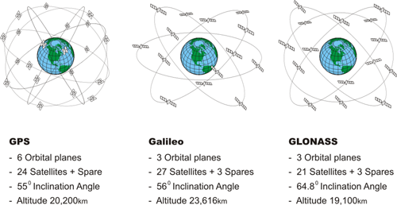
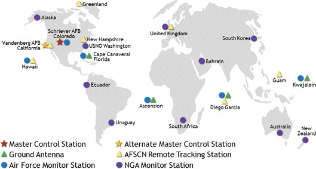
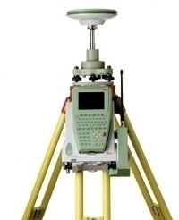
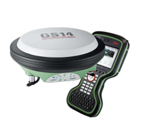
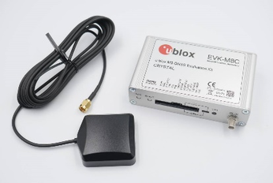

# Introduction

Nowadays there are many positioning systems, owned and managed by different nations / government.
In particular, the main GNSS are:

- GPS (Global Navigation Satellite System) – USA
- GLONASS – Russia
- GALILEO – European Union
- BeiDou – China
- QZSS (Quasi-Zenith Satellite System) – Japan
- IRNSS (Indian Regional Navigation Satellite System) – India

## Components of a satellite positioning system

A satellite position system is generally composed by the space segment, the control segment, and the user segment.

### Space segment

It is constituted by the satellites orbiting around the Earth, usually guaranteeing an almost global ground coverage. Therefore, the visibility of a minimum number of satellites is possible almost everywhere.
The main satellite tasks are:

- Transmit their positions (ephemeris) as well as the signal required to user segment for navigation / positioning applications,
- Receive and store information from control segment,
- Correct the orbits by on-board rockets, which managed by control segment.

### Control segment

It is composed by the ground stations used to control and manage the entire satellite
constellation.
Main tasks of the control segment are:

- Tracking the satellites of the space segment
- Determination, prediction, and distribution of satellite ephemeris.

### User segment

It is composed by the users that would know their position on the Earth. They need a receiver and an antenna.
There are many «level» of instruments, depending on the quality of the on-board electronics:

Geodetic type receivers:

- for monitoring / long static survey purposes

  

- for real time applications

  

Low-cost receivers:

- with the possibility of accessing to raw-data

  

- Embedded in other devices:

  
