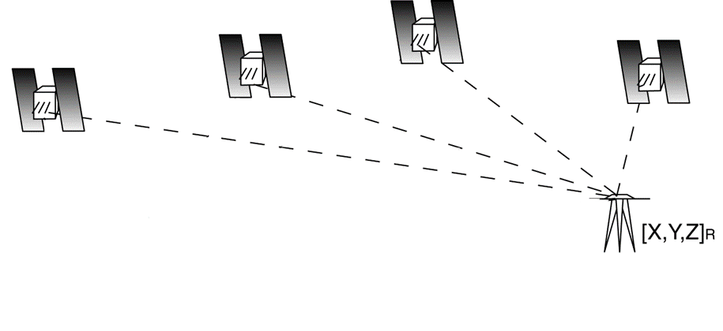
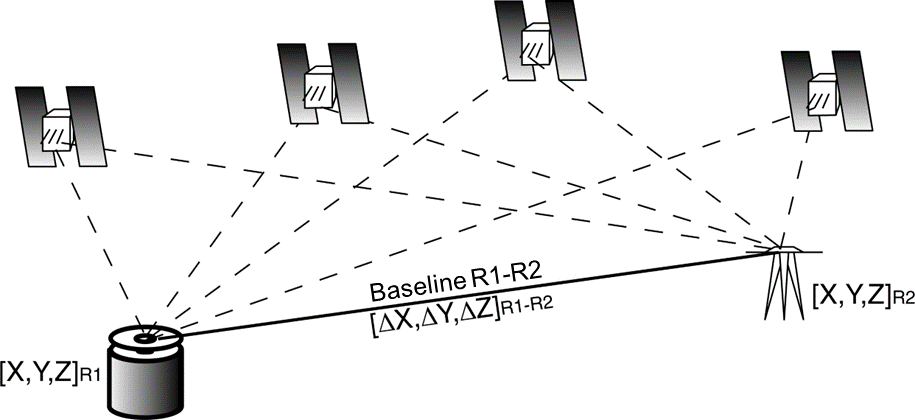
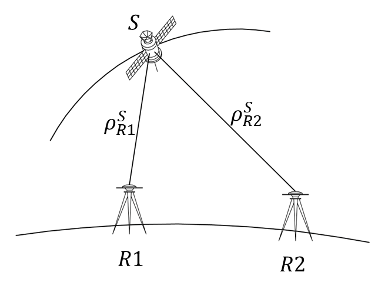
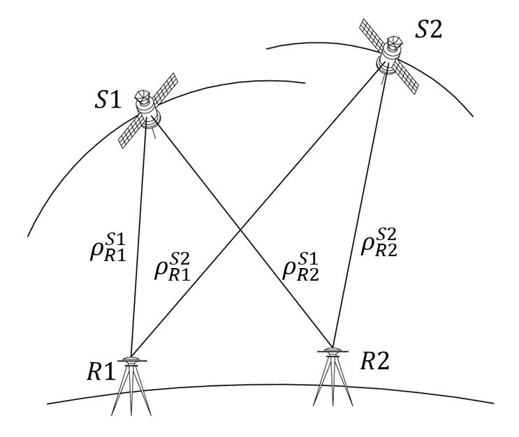

# Positioning methods

## Absolute positioning

Combining observation from one receiver to multiple satellites the unknown coordinates of the receiver, as well as the clock error, can be estimated. For each epoch, there are four unknowns, therefore at least four satellites are required (with pseudo-range observations). Tropospheric and Ionospheric delays need to be modelled.

For static positioning, observations coming from multiple epochs can be processed together, improving the estimation accuracy and allowing introducing also phase observations.
Absolute positioning usually leads to accuracy of the order of few meters without very long point occupation (some hours) and/or Precise Point Positioning (PPP) solutions.

## Relative positioning

Combining observations from two receivers to the same satellites, the vector (baseline) between them can be estimated instead of the absolute position of the receiver.

This combination usually allows to reduce the estimation error. If one of the two receivers (base station) has known coordinates, the position of the other one (rover) can be estimated. Different solution approaches can be implemented, e.g. single differences or double differences.

### Single differences

Single differences are computed by subtracting observations from the two receivers to the same satellite.

\[
{L}_{R1}^{S} - {L}_{R2}^{S} = {\rho}_{R1}^{S} - {\rho}_{R2}^{S} + c \left( d{t}_{R1} - d{t}_{R2} \right) + c \left( d{t}_{R1} - d{t}_{R2} \right) + {I}_{R1}^{S} - {I}_{R2}^{S} + {T}_{R1}^{S} - {T}_{R2}^{S} + \left( {N}_{R1}^{S} - {N}_{R2}^{S} \right) \lambda
\]

By means of this combination, if the two receivers are close enough (max few km), the effect of tropospheric and ionospheric model error can be mitigated, since the carrier phase is passing almost through the “same” atmosphere. Moreover, the difference of phase ambiguities is still an integer number. On the other hand, nothing happens to receiver clock error, since the two receivers are different.

### Double differences

Double differences are computed by subtracting two single difference equations, considering different reference satellites.

\[
{\phi}_{R1}^{S1} - {\phi}_{R2}^{S1} - \left( {\phi}_{R1}^{S1} - {\phi}_{R2}^{S1} \right) = {\rho}_{R1}^{S1} - {\rho}_{R2}^{S1} + c \left( d{t}_{R1}^{?} - d{t}_{R2}^{?} \right) + {I}_{R1}^{S1} - {I}_{R2}^{S1} + {T}_{R1}^{S1} - {T}_{R2}^{S1} + \left( {N}_{R1}^{S1} - {N}_{R2}^{S1} \right) \lambda - \left[{\rho}_{R1}^{S2} - {\rho}_{R2}^{S2} + c \left( d{t}_{R1}^{?} - d{t}_{R2}^{?} \right) + {I}_{R1}^{S2} - {I}_{R2}^{S2} + {T}_{R1}^{S2} - {T}_{R2}^{S2} + \left( {N}_{R1}^{S2} - {N}_{R2}^{S2} \right) \lambda \right]
\]

Applying this combination clock errors are removed, phase ambiguity remain an integer values to be estimated, and tropospheric and ionospheric delays are reduced (they can be neglected with baselines shorter than 15 km). Note that combining twice the observations, the observation error has a variance 4 times the original ones, therefore the observation noise increases.
With a proper satellite geometry (few sky obstructions), no cycle-sleeps, and no external disturbing effects (e.g., multipath) the following accuracies can be obtained for static surveys processed with double difference approach.

