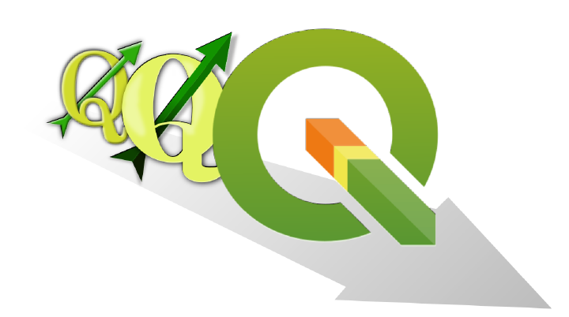
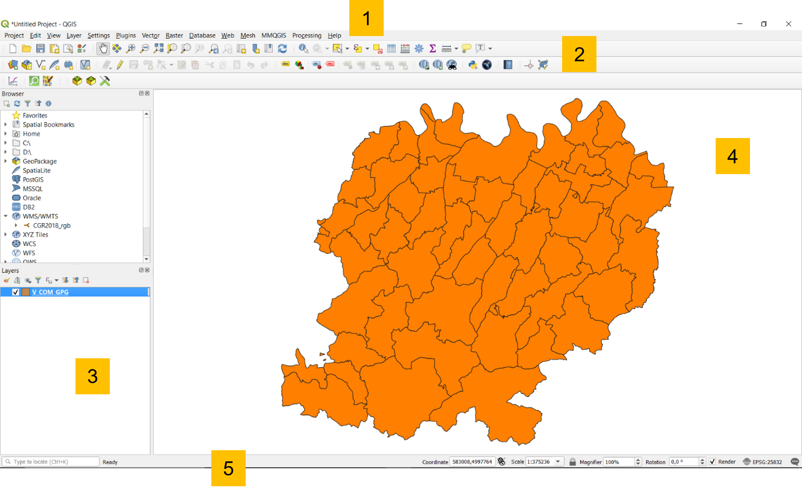
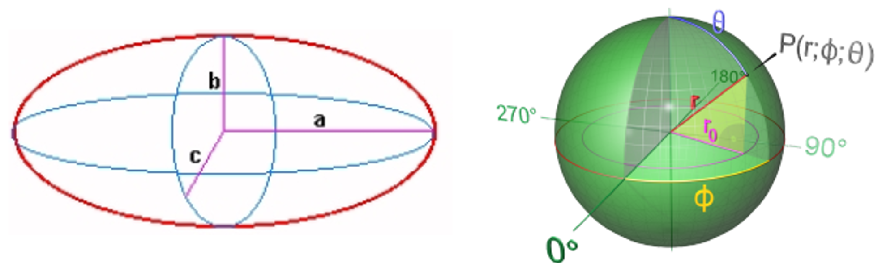
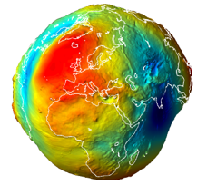
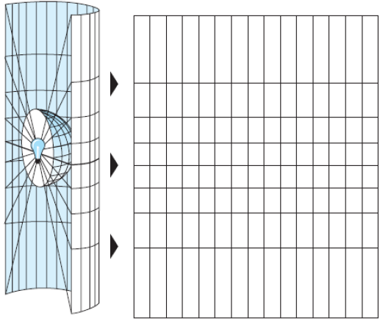
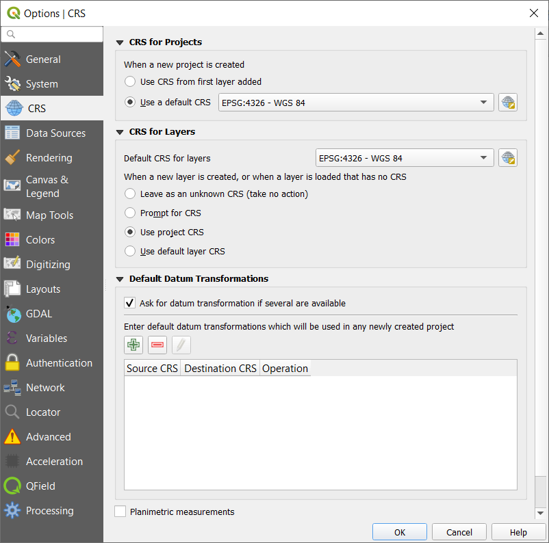
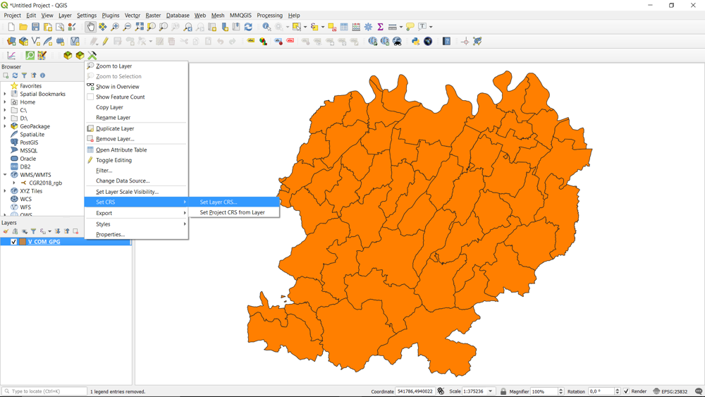
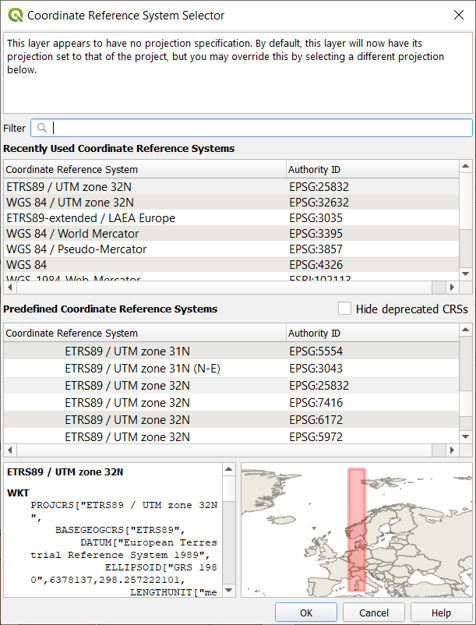
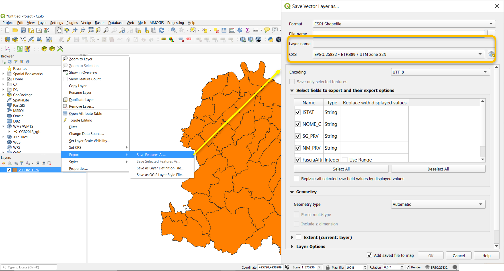
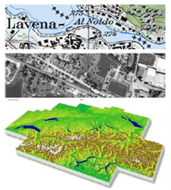

# Introduction to GIS

## **What is a GIS?**

A **GIS** (*Geographic Information System*) is a computerised information system that allows the **acquisition**, **storage**, **analysis**, **visualization** and **exchange** of geographical information in the form of **geo-referenced data**.

It then allows data to be associated with their geographical position on the earth's surface and processed in order to extract information.

The most common **GIS software** are:

* ArcGIS
* QGIS
* GeoMedia
* SagaGIS
...

**Why QGIS?**

It is:

* Free and Open Source
* Constantly updated -> Every 4 months a new version is released

But it has the great advantage for those working with older versions that it can also handle projects made with newer versions.

## **Main functionalities**

* **Data visualisation**:

Vector and raster data can be displayed and superimposed in different formats and map projections.

* **Data exploration and map print layout creation**:

You can compose maps and interactively explore spatial data through an easy-to-use graphical interface.

* **Creation, editing, management, export**:

Spatial analysis of data can be performed 

* **Link to external DBs**:

You can view and query data stored on external DBs (e.g., MySQL, PostgreSQL...).

* **Publication of maps on the web**

With native and non-native plugins, QGIS allows you to define settings to make an interactive map to share on web pages.

...and much more!

## Graphic User Interface

The GUI of QGIS Desktop is mainly composed of:

1. **Menu toolbar** where you can find the main QGIS project features grouped by themes.
2. **Attributes and Vector toolbar** customizable that includes shortcuts to the most commonly used tools for data manipulation in a GIS environment.
3. **Loaded layers list** which indicates what data have been included in the project, specifying their characteristics, symbology and visibility.
4. **Map view** that is the map canvas on which the geographic and geometric component of the data can be evaluated graphically.
5. **Status bar** indicating the status of any processings initiated and any errors encountered.

## Data management

**How QGIS handles geographic data?**

What is needed in order to work with QGIS?

* Knowing how to handle geographical data in **different geographical and/or projected coordinate systems**;
* Knowing how to manage a project;
* Knowing how to import:
    * **Vector** data (e.g. shapefile .shp, GeoJSON .geojson...)
    * **Raster** data (e.g. .tiff)
* Understanding the functionalities of **plugin**

**What is the purpose of a reference system?**

**Reference System** -> set of rules that allow us to determine the position in space in a unique way.

This geometric concept is even more important in cartography to correctly locate a point in the territory.

## Geographical reference system

The concept of geographical reference system is the best known and most comprehensive, and perhaps also one of the most powerful georeferencing systems.

**It is metric, standard, stable, unique.**

It uses a well-defined and fixed reference
based on:

* Earth's axis of rotation
* centre of mass
* Greenwich reference meridian
* Equator

Normally, different R.S. are used for planimetry and altimetry....

* **planimetry**: ellipsoid reference (spherical for small or large scales). Why it is not used for altimetry? No link with the gravity field.

* **altimetry**: geoid reference (no simple analytical description). Why is it not used for planimetry? It is very complex to use in the treatment of observations made for planimetry (due to angles and distances conversion).

## Datum

A **datum (geodetic)**, is a geodetic reference system that allows the position of points on the Earth's surface to be defined in mathematical terms.

**Datum** -> Set of parameters defining the **shape** of the ellipsoid used and its **orientation**.

A datum is composed by 8 parameters:

* 2 for the ellipsoid shape;
* 6 for the position and the orientation:
    * latitude e longitude on the ellipsoid (2)
    * geoid height
    * 2 components of the deviation from the vertical
    * azimut of the ellipsoid

## Projections

The surface of the earth is curved but there are many reasons for representing it on a **plane**, even in numerical cartography.

* The map used to represent the results of GIS analysis is flat.
* Flat maps are scanned and used to create GIS data.
* The raster model is flat (2D)
* It is not possible to see all the land on a curved surface at once
* It is much easier to make measurements in the plane (areas, distances, directions)

For this reason, different **map projections** are also used in numerical cartography.

Cartographic projections carry coordinates from the ellipsoid of the reference system to the map plane. **The two surfaces are not topologically equivalent, so it is not possible to move from ellipsoid to map without deformation.**

Depending on the **geometric shape** adopted, the projections are classified as:

* Planar projections;
* Cylindrical projections;
* Conic projections.

There are many types of map projections, those used in **Italy** are:

* **UTM** (Universal Trasversal Mercator), globally adopted;
* **Gauss-Boaga**, used for the Roma 40 Monte Mario datum;
* **Cassini-Soldner**, used for Nuovo Catasto dei Terreni Italiano.

Ultimately, the definition of a reference system is given by:

* *geographical coordinate systems*:

**Datum** (es. WGS84 or Roma 40 Monte Mario)

* *sistemi di coordinate proiettate*:

**Datum + projection system** (es. WGS84-UTM32N or Roma 40 Monte Mario - Gauss Boaga Fuso Ovest)

In addition, all GIS softwares use geometric parameter registers, the best known of which are the **EPSG** (European Petroleum Survey Group) codes that unambiguously define the various world reference systems.

**How does QGIS handle geographical data?**

The management of **reference systems** is always a particularly delicate element in a GIS.

In QGIS, there are 2 different reference system managements: 

* **Project R.S.**
* **Single layer R.S.**

QGIS is capable of reprojecting on the fly individual layers using the [proj4](https://proj.org/) libraries, provided that the R.S. of the individual layer is defined.

QGIS uses **EPSG** (European Petroleum Survey Group) codes to uniquely define the different global reference systems.

### RS Settings

In the settings panel (***Settings → Options → CRS tab***) it is possible to define the rules with which the layers RS can be managed.

It allows you to define which SR to adopt when opening a new project or how to manage layers without information on the reference system used.

### Layer RS

The **SR of the individual layer** can be managed by right-clicking on the layer.

### Reprojection - Shapefile

You can manage the re-projection of vectors: ***Right click on the layer → Save features as…***

## Reality modelling with QGIS

There are mainly two ways of conceptualising or modelling reality from a geographical point of view by considering objects as:

* **Discrete objects**: can be observed or described in the real world and identified by its position

* **Distributed objects**:
represent a quantity whose value is a function of position and can be measured at any location

