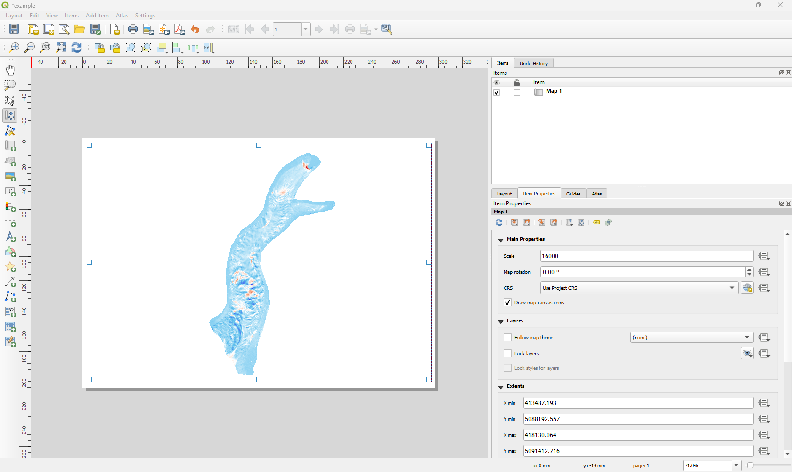
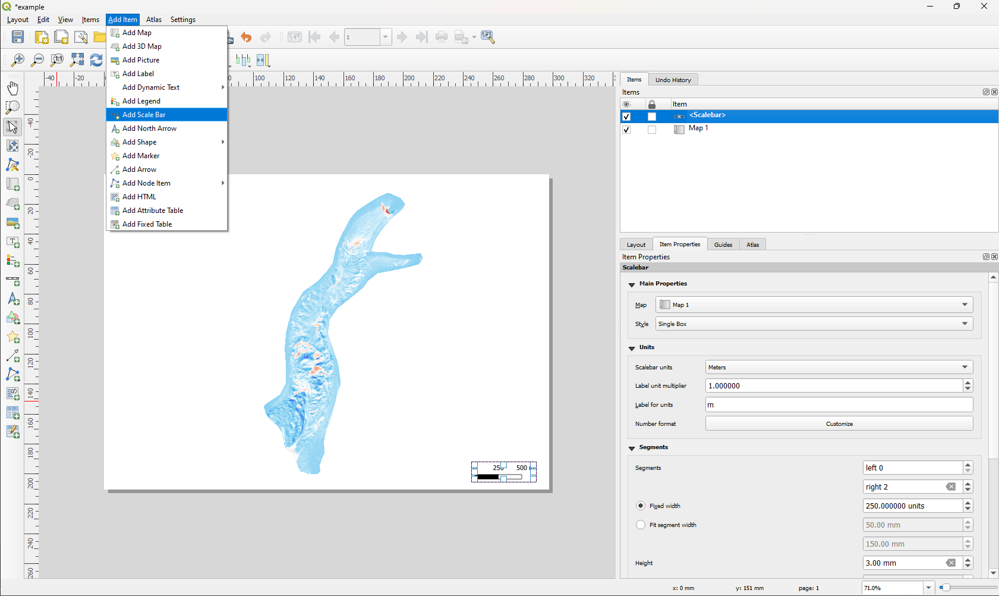
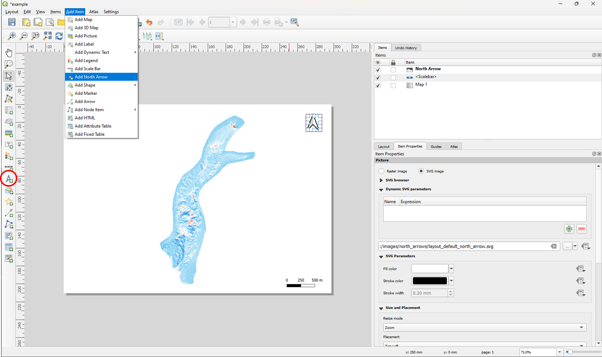
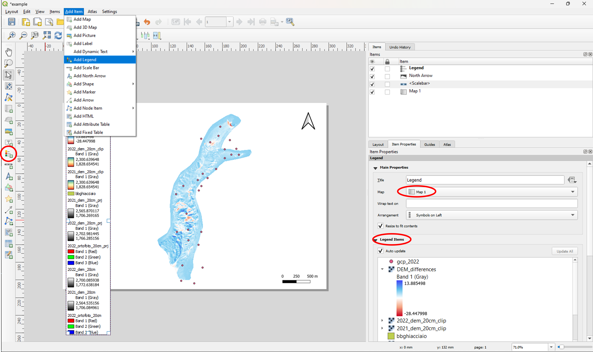
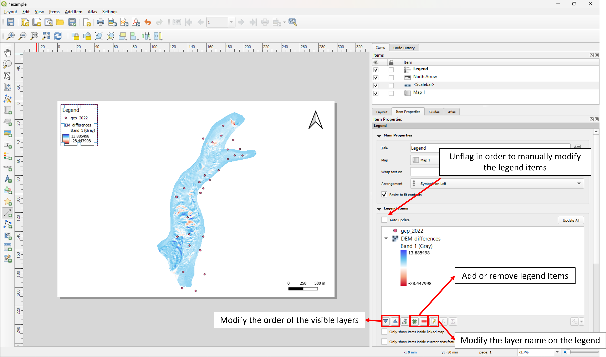

# Layout

Once the map of interest has been created, it is necessary to create a **print layout**.

When dealing with cartographic layouts, some elements are considered fundamental for the final results:

* **scale bar**
* **north arrow**
* **legend** for all the layers the require it

Other elements that are strongly suggested to be included:

* cartographic grid
* additional text boxes with info about the project​

QGIS uses the so called **Layout Manager** as a tool for defining and customizing all the fundamental map elements.​

Access this tool by clicking:

***Project -> New print layout -> define a title -> click OK***

*Be careful!* If more than a layer is active/visible on the project and you’re interested in creating a layout only for one layer, take care about the fact that only the one of interest is active.

The **extent** and **units of measurement** (for scale and grid, if any) are those of the originale associated QGIS project, so it is a good idea to set the **Reference System** correctly according to the information to be displayed on the print layout.

In order to change the page orientation, click the right button on the center of the object -> ***Page Properties -> Orientation***

## Insert the map

From the *Add Item* menu, choose **Add the map** and finalize the insertion of the object inside the page by selecting the map rectangular area within the layout. Similarly, this object can be added to the layout by clicking the corresponding icon on the left bar of the bar composer. The map can then be moved within the frame are after clicking the command (***symbol to be inserted HERE***)     

The map display scale is defined in the *Item Properties* window to the right of the layout composer.

## Insert the scale bar

Once you have selected **Add scale bar** from the *Add Item* menù or from the left bar, draw a rectangular area on the map to define the area where you would like to insert the element.

## Insert the North arrow

Once you have clicked **Add North Arrow** from the *Add Item* menù or from the left bar, draw a rectangular area on the map to place the arrow on the desired position.

## Insert the legend

Once you have pressed **Add Legend** from the *Add Item* menù or from the left bar, draw a rectangular area on the map to insert the legend where you desire.

[...]

## Print layout with multiple maps

To print two separate maps by changing the layers and their style, you can set the appropriate functions to lock the active layers.

For example, insert the second map with the *Add Map* command, creating a smaller window. Then, flag *Lock layers* and *Lock styles for layers* to ensure that changes made to the other map(s) do not affect the selected map.

In the map window it is also possible to set the overview of the second map by specifying the desired style.

## Save the print layout

In the toolbar, click on the highlighted icons to save the composed layout as an image or PDF file.

In the save window, select the desired file format.

[...]