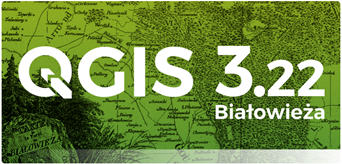
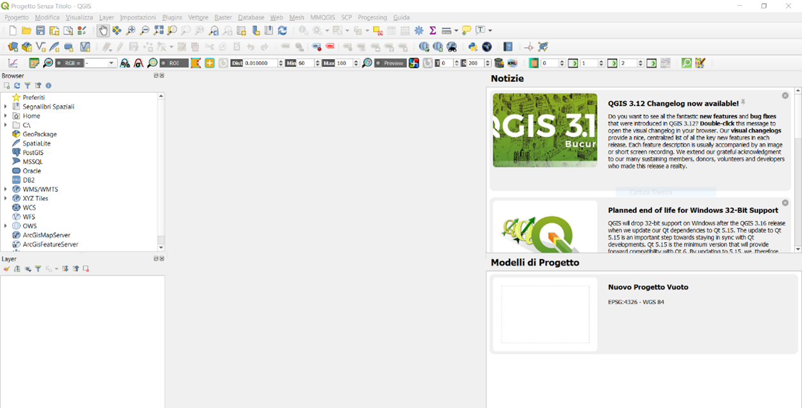

# Overview

The module 4 of the course is dedicated to **Geographic Information System** (GIS).

## Learning outcomes

Through a combination of theoric concepts and hands-on exercise, students will understands the essentials of Geographic Information Systems adoption in the context of environmental studies. Also, learners will get familiar with the manipulation of vector and raster data for quantitative and qualitative analysis with practical applications in a free and open-source GIS environment. Eventually, students will understand how to prepare cartographic output and reports to share the results of their studies.

## Table of contents

1. **[Introduction](intro.md)**: this section illustrates the basic concepts of GIS theory, essential to understand how GIS software operates. Moreover, an overview of the Graphic User Interface of the adopted software is given.

2. **[Vector data](vector.md)**: this page collects a set of guided practical exercises for the manipulation and analysis of vector data in a GIS environment. Illustrated procedures refer to useful routine operations for the study of data collected during the summer school campaign.

3. **[Raster data](raster.md)**: this page collects a set of guided practical exercises for the manipulation and analysis of raster data in a GIS environment. Illustrated procedures refer to useful routine operations for the study of data collected during the summer school campaign.

4. **[Layout](layout.md)**: finally, a simple guide for the creation of a print map layout is provided, highlighting the importance of some essential objects for a proper cartographic representation.

## Software

The adopted software for the practical sessions of this module is **QGIS**.

QGIS (formerly known as Quantum GIS) is a **Free and Open Source Geographic Information System**. The project was born in May 2002. QGIS is a GIS software available to anyone who owns a PC with commonly used platforms such as macOS, Linux, UNIX, Microsft Windows and, experimentally, Android.

QGIS is released under the **GNU General Public License (GPL)**, which makes it possible to modify the source code developed in the C++ language and grants access to a free GIS programme that anyone can freely modify, following precise community guidelines.

It is very similar in user interface and functions to equivalent commercial GIS packages. QGIS is maintained by a group of **voluntary community developers** who publish a new stable version approximately every four months.

### Installation

The version to be used for the course exercises is the current Long Term Release (LTR, most stable version) 3.22, which can be downloaded from the Downloads page of the project website: https://www.qgis.org/it/site/forusers/download.html

1. On the download page of the official site, select the long support version (LTR) of QGIS 3.22 dedicated to your operating system (Windows, macOS, Linux or Android)

2.	Save and execute the installation file.

3. Once the procedure is complete, start QGIS Desktop 3.22. The correct installation of the software is verified by displaying the graphic interface.

