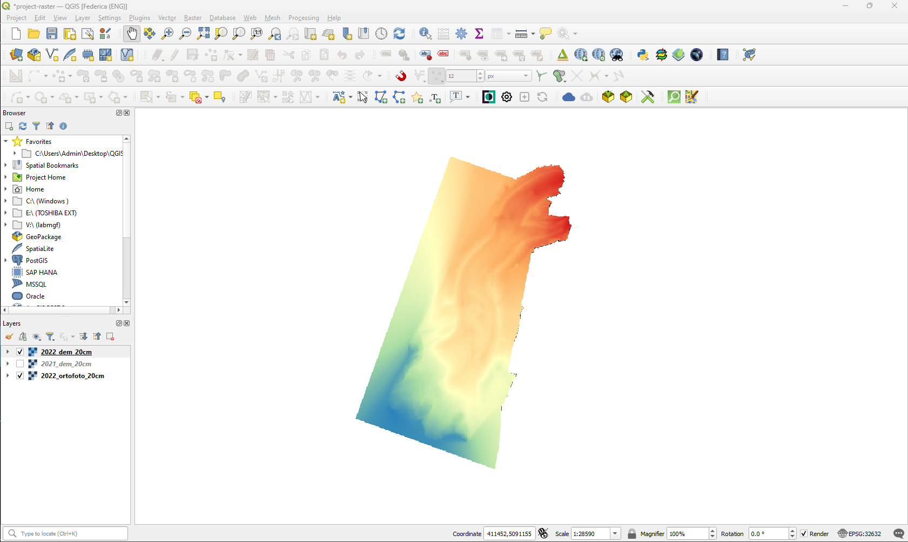

# Raster data

The **raster** model is a widely adopted approach for storing and representing information on continuous objects, coded using a set of grid cells, each with its relative value that represents the conditions of the given area covered by the pixel. Values are cells of a grid with certain extensions and a certain resolution.

Such data format is particularly useful to represent features whose characteristics are not homogeneous on a given area.

Some examples of data that are commonly available and distributed as raster are:

* **Aerial photos**, including satellite imagery and orthophotos.
* **Digital Terrain Models** (DTM) which can be mainly subdivided into:
    * *Digital Elevation Models* (DEM) which is a digital file with ground surface elevation values at regularly spaced inntervals in the horizontal plane;
    * *Digital Surface Models* (DSM) that represents in digital form the heights of the upper part of the terrain including building, infrastructures and trees without the filtering procedures used to produce DEMs.
* **Thematic maps** representing the variation of geomorphologic characteristics (e.g. geological maps) or coverage (e.g. land cover maps) of a given territory.

In a GIS, each raster layer possesses pixels (cells) of a consistent size, which defines its **spatial resolution**. This characteristic becomes evident when you observe an image at a reduced scale and subsequently magnify it to a larger scale.

Images characterized by a pixel size that encompasses a limited area are referred to as **high-resolution** images, as they allow for discerning a substantial level of detail within the image. Conversely, images featuring a pixel size that encompasses a larger area are termed **low-resolution** images, as they exhibit a reduced level of detail.

In the following guided tutorial you will learn how to load raster data in the QGIS environment, manipulate and style layers and execute common operations such as clip and raster calculations. The data used for this exercise can be downloaded [here](INSERIRE LINK A RISORSE DATI MESSE IN REPOSITORY) and consists of the Belvedere glacier orthophotos and digital elevation models produced during the 2021 and 2022 monitoring campaigns.

## Loading data

In the data folder you just downloaded, you can find 7 different files referring to 3 distinct raster data layers.

In particular:

1. All files named [*2022_ortofoto_20cm*](INSERIRE LINK A FILE IN REPOSITORY) refers to the orthophoto of the glacier area of interest in a tiff format, as surveyed with UAVs inn 2022. The meaning and role of the different file extensions will be explained in the next steps.

2. [*2021_dem_20cm*](INSERIRE LINK A FILE IN REPOSITORY) is the digital elevation model produced at the end of the 2021 survey campaign.

3. [*2022_dem_20cm*](INSERIRE LINK A FILE IN REPOSITORY) is the digital elevation model produced at the end of the 2022 survey campaign.

For adding a new raster data layer to a QGIS project, click from the menu bar:

***Layer > Data source manager***

### TIF import

Similarly to the import procedure for vector data, select the **Raster** tab and in the **Source** section, by clicking the **Browser** (...) icon, look for the *2022_ortofoto_20cm.tiff* file on your laptop. After selecting it, click **Add**. Hence, close the Data source manager window and check that the orthophoto of the Belvedere glacier area is correctly visible on the map canvas view.

The loaded vector layer will also appear in the QGIS layer section with its name close to a checkboard icon, symbolizing that such data is a raster.

The chosen file is a **Tag Image File** (TIF), a widely adopted format for raster data in GIS environments. Usually, the main file with .tif extension is accompained by another file with the same name and the .tfw extension. Such file saved in plain text format contains information on the georeferencing of the reaster itself. Indeed, they store information on the X and Y pixel size, rotation as well as the global coordinates for the top-left corner of the raster.

### Drag & drop import

Exactly like the case of shapefile import, raster files can be imported in QGIS project with the drag&drop shortcut. Try to execute this operation with the DEM rasters: *2021_dem_20cm.tif* and *2022_dem_20cm.tif*.

The expected map canvas view for each DEM is the one depicted below in grayscale.

## Layer properties

General information on each layer loaded in a QGIS project can be accessed through the **Properties** panel. As suggested for vector files, it is recommended to check this information everytime a new layer is added to the page: it helps understanding the source and nature of data as well as if any interpretation issue has affected the layer loading.

To view the properties of the raster, right-click on the layer and select **Properties...**. The newly appeared window contains different tabs. In the next sections some of the most useful for routine procedures will be explained in details foor the case of raster.

### Information

This read-only tab summarizes the main information and metadata of the chosen layer. In the case of raster layer it is important to mention, in addition to info field in common with vector data, the information about number of band, band statistics, grid dimensions and pixel size giving important information on the spatial resolution of the raster itself.

### Symbology

The layer visual representation in the map canvas can be modified as preferred in the **Symbology** tab. Different type of representation can be chosen from the dropdown menu on top of the window and differs from the vector data ones.

#### Singleband gray

The **singleband gray** is the default view of raster data when they are loaded on QGIS. It consists in representing them with just one color gradient that goes from black, for lower values, to white, for higher ones.

#### Singleband pseudocolor

The **singleband-pseudocolor** render type, as the **singleband-gray**, is suitable for showing quantitative information. It allows to choose a color ramp and also (choosing for Mode: *Equal Interval* or *Quantile*) a number of classes there to categorize the different intervals of values to be represented. Choosing for Mode:*Continuous* the number of classes cannot be manually set.

[...]