# Vector data

**Vector data** are widely used in GIS environment for the representation of information of discrete objects. Vector model features are particularly useful for representing and storing discrete objects such as buildings, roads, particles, etc.

They usually consist of two components:

1. **geometry**
2. **thematic component**

The geometry of each single vector object is defined by one single node or a set of interconnected vertices. Each of such vertices is located in the vector data reference system using a set of **x** and **y**. For 2.5D vector data the **z** coordinate values are also present to represent variables such as height, depth or other.

Hence, the vector model can represent geographical entities through the following geometries:

* **Points**: single set of x, y and z values;
* **Lines**: ordered set of points whose starting node is different from the last one;
* **Polygons**: ordered set of points whose starting node is coincident with the ending one.

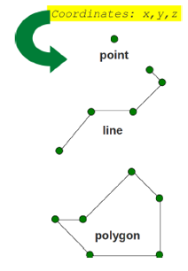

Each vector object in addition to its geometry has a set of thematic information associated to it, the so called **attributes**. Attributes of a vector object usually describe its meaning, properties and/or characteristics in the real world that it represent schematically in a GIS environment.

One or multiple vector objects are stored in **layers**. Objects of a GIS layer have the same geometry type and the same set of attributes.

In the following guided tutorial you will learn how to load vector data in the QGIS environment, manipulate and style layers and execute common operations such as joins and selectins. The data used for this exercise can be downloaded [here](INSERIRE LINK A RISORSE DATI MESSE IN REPOSITORY) and consists of the Belvedere glacier perimeter and GNSS measurements of Ground Control Points (GCPs) collected during the 2022 and 2023 monitoring campaigns.

## Loading data

In the data folder you just downloaded, you can find 8 different files referring to 3 distinct vector data layers.

In particular:

1. All files named [*belvedere_perimeter*](INSERIRE LINK A FILE IN REPOSITORY) (6) refers to the representation of the glacier area of interest in a shapefile format. The meaning and role of the different file extensions will be explained in the next steps.

2. [*gcp_2022*](INSERIRE LINK A FILE IN REPOSITORY) is a comma-separated-values (csv) file that contains the information about the GCPs measured in the 2022 campaign.

3. [*gcp_2023*](INSERIRE LINK A FILE IN REPOSITORY) is a comma-separated-values (csv) file that contains the information about the GCPs measured in the 2023 campaign.

For adding a new vector data layer to a QGIS project, click from the menu bar:

***Layer > Data source manager***

### Shapefile import

The **Data source manager** window represent the main place in QGIS for uploading rigorously not only vector data but also other type of files. Indeed, depending on the nature of the data the user is willing to upload, it offers different tabs with guided procedures. For the case of vector layer, select the **Vector** tab and in the **Source** section, by clicking the **Browser** (...) icon, look for the *belvedere_perimeter.shp* file on your laptop. After selecting it, click **Add**. Hence, close the Data source manager window and check that the polygonal shape of the glacier is correctly visible on the map canvas view.

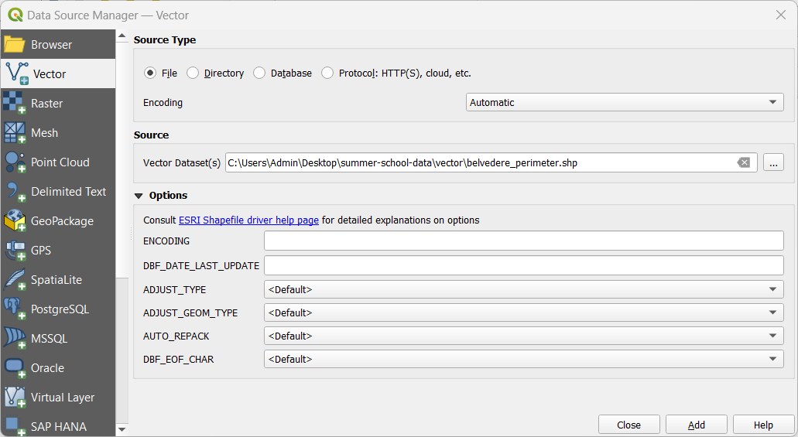

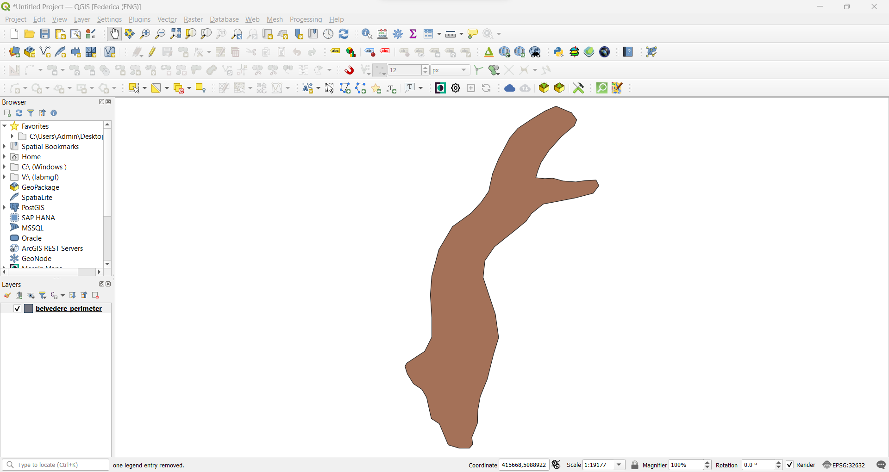

The loaded vector layer will also appear in the QGIS layer section with its name close to the colour with which it is represented on the map canvas.

The chosen file is a shapefile, a widely adopted format for vector data that indicates a group of files with the same file name but with different extensions:

- *.shp* referring to the vector geometry;
- *.shx* containing the positional index of the vector geometry and allowing flexible and efficient ordered object search inside the layer;
- *.dbf* that contain the tabular information, specifically the attribute headers and values for each object in the layer;
- *.prj* that store information about the reference system of the vector data;
-*.cpg* containing the required information for the character encoding of the dbf file;
- *.qmd* storing the metadata of the vector layer.

It is important to understand that at least the first 3 files (shp, shx, dbf) are needed in order to correctly decode the layer information in a GIS environment, while the others represents additional useful information about the nature and/or source of the data.

### CSV import

Another commonly adopted format for vector data creation and sharing of point geometry type is the csv. Such data can be uploaded through the Data source manager with the guided procedure defined in the **Delimited Text** tab. Similarly to the shapefile procedure, the choice of the file is done with the Browse button (...) on top of the window. For this example, select the *gcp_2022.csv* file. Then a series of additional information are required for the correct uploading:

- **File Format** asks information about the type of delimiter used in the chosen file for decoding correctly its tabular data. Usually, QGIS is able to detect it automatically. Such information could also be easily understood by inspecting the preview of the data table in the **Sample Data** section. In this case the delimiter is the semicolon.

- **Record and Field Options** is the section where information about header presence or numerical format standard should be indicated.

- **Geometry definition** needs information on how the geometry of the point objects is coded in the csv table. First the format of storage has to be chosen (in this case Point coordinates) and then the user is asked to associate detected fields in the table to X, Y and optionally Z or M values. Only with a correct association the software is able to locate the vector layer objects in the reference system space. In this case, X:*east* field, Y:*north* field in the Geometry CRS *EPSG:32632 - WGS84 / UTM Zone 32 N.

Once all the sections are filled as indicated, click **Add** and check that the GCPs points are correctly visible on the map canvas view.

As a result, the 2022 GCPs layer will be positioned on top of the glacier one previously loaded.

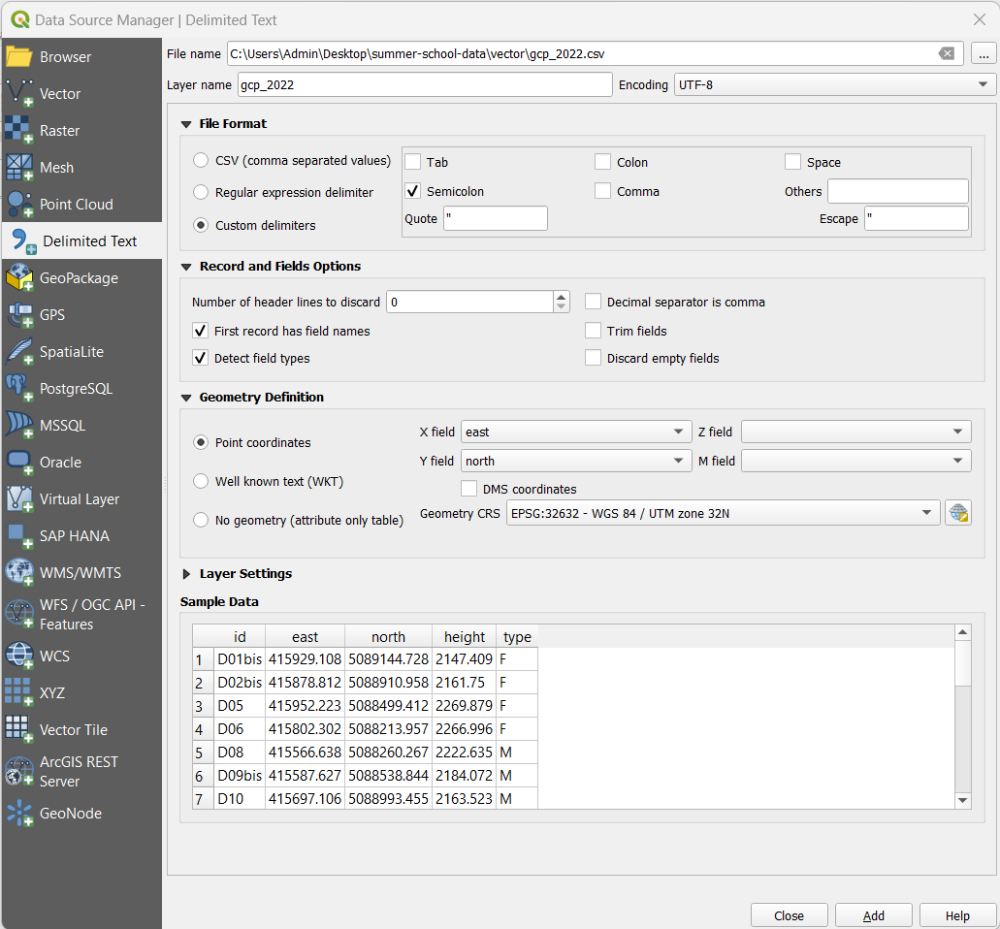

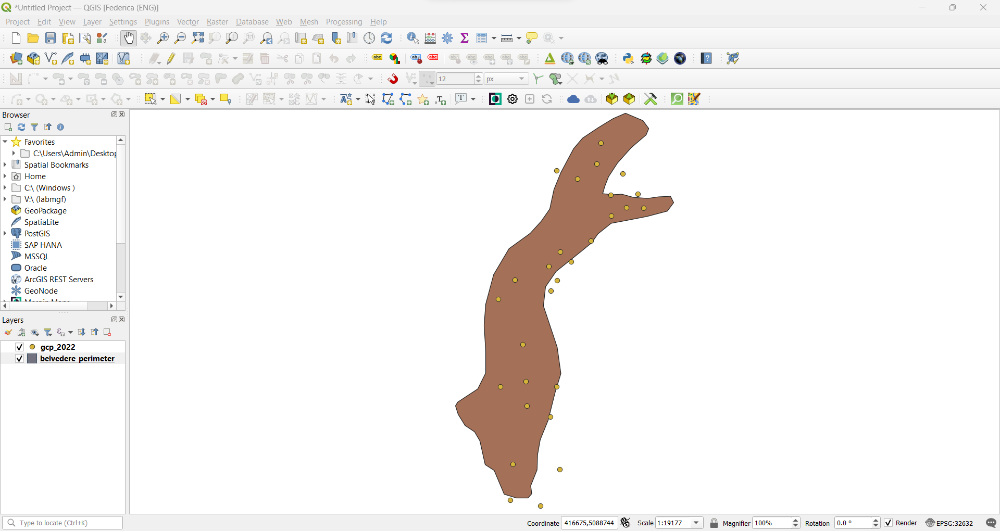

### Drag & drop import

The presented procedures represent the most rigorous way to import data in QGIS. Indeed, it is possible to load data to your QGIS project through a simple drag and drop on the map canvas in a quicker way, However, it is import to always pay attention to their format because for some type of data this shortcut affect the correct interpretion of vector file. For example, while there are no differences for the shapefile, the result for the csv is very different from the previously explained procedure. With the drag and drop, the csv is loaded as a simple table data layer with no geometry data, thus removing the possibility of exploring the data it contains by exploiting its geometric information.

You could try this by using the drag&drop procedure for loading the *gcp_2023.csv* that will be used later for analysis and calculation.

## Layers management

In the **Layers** section of the QGIS Graphical User Interface you could manage the visibility and appearance of data layers. For example, by unchecking the box close to the symbol of a given data layer, you can temporarily hide the geometries belonging to it. This operation can be particularly useful when you are doing specific analysis on  other layers and you want to evaluate better their graphic result representation on the map canvas.

Instead, if you'd like to remove from the project a specific layer, you should right click on it and select the **Remove layer..** option. In this case, the layer data are definitively removed from the project and can be evaluated only by reuploading the layer through one of the import procedure previously explained. It is important to note that the removed layer are removed only from the QGIS project and they are not deleted also from their corresponding path folder in your device.

## Layer properties

General information on each layer loaded in a QGIS project can be accessed through the **Properties** panel. It is recommended to check this information everytime a new layer is added to the page: it helps understanding the source and nature of data as well as if any interpretation issue has affected the layer loading.

To view the properties of the shapefile, right-click on the layer and select **Properties...**. The newly appeared window contains different tabs. In the next sections some of the most useful for routine procedures will be explained in details.

### Information

This read-only tab summarizes the main information and metadata of the chosen layer. In particular it includes information about the file path, name, geometry type, geographical extension, total number of objects, reference system, measurement unit, attribute fields...

In this section it is always important to check the order of magnitude of the number in the *Information from provider* - *Extent* field as a double check on the coordinate values matching the expected order for the assigned reference system.

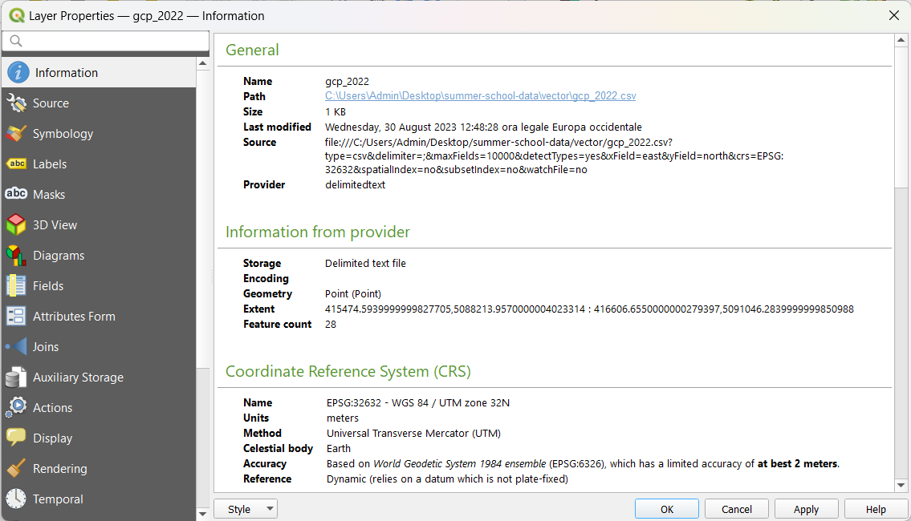

### Symbology

The layer visual representation in the map canvas can be modified as preferred in the **Symbology** tab. Different type of representation can be chosen from the dropdown menu on top of the window.

#### Single symbol

After selecting **Single symbol** from the dropdown menu, you access the menu for defining the style for the symbol associated to each object inside the chosen layer. This modality represents all data in the same way. In the options it possible to change color, level of opacity, size, and type of the symbol. Advanced edits (symbol fill, stroke etc) to the style could be done by clicking on *Simple Marker**.

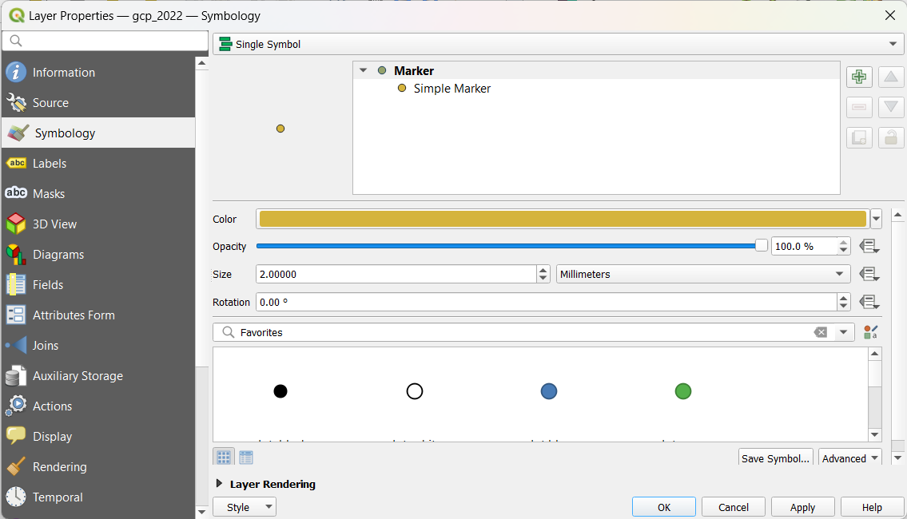

#### Categorised

The **Categorized** style option allows to represent data according to the values contained in a chosen layer field. This modality is suggested when the values contained in a field consists of a set of recurring values. In order to apply it, click on the arrow on the value field and select the field with the category and then click on **Classify**. After exploring the values present in the chosen attribute column inside the layer, QGIS automatically suggest a categorisation with given values and legend descriptions. Such combination can always be modified by clicking on each symbol for styling, or double-clicking on value or legend field for manually typing the values and descriptions.

For the case of 2022 GCP points, select the *type* field as the classification values and style accordingly. This will help identifying more intuitively fixed or moving points on the map canvas.

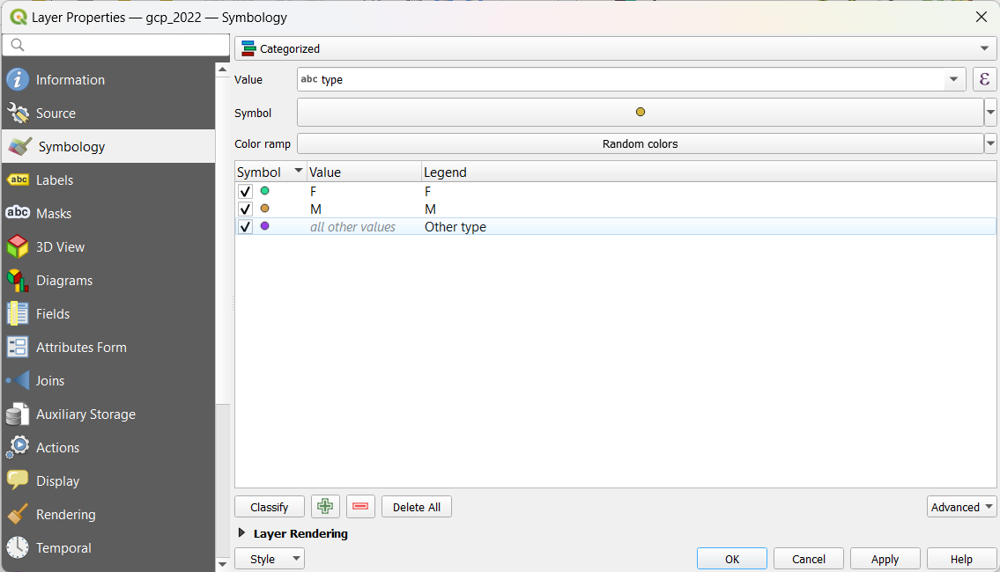

#### Graduated

The **Graduated** style option allows to represent data according to the values of a continuous scale contained in a chosen layer field. This modality is suggested when the values contained in a field consists of a set of unique values along a continuous scale. In order to apply it, click on the arrow on the value field and select the field with the category and then click on **Classify**. After exploring the values present in the chosen attribute column inside the layer, QGIS automatically suggest a classification with given values and legend descriptions. Such combination of class can always be modified by clicking on each symbol for styling, or double-clicking on value or legend field for manually typing the values and descriptions. Color ramp for the color method classification che be defined as preferred.

When representing vector data with this method, it is important to pay attention to the mode of classification that by default is *Equal Count (Quantile)*. Everytime classification symbology is chosen, first check the **Histogram** tab, click **Load values** and evaluate the numeric distribution of the values in the vector layer. Then, in the **Classes** tab, select the more appropriate mode and number of classes.
Everytime an option is changes, it is needed to click **Classify** for making an edit effective.

For the case of 2022 GCP points, select the *height* field as the classification values and style accordingly. This will help understanding the topology of the study site.

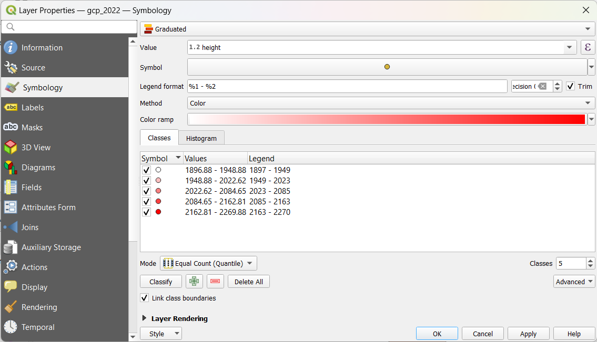

### Labels

In order to better identify the different objects of a given layer, it is also possible to insert labels containg values associated to the corresponding object on the map. For example, it is possible to show on the map canvas the label of the ID value associated to each GCP. In order to do so, click on ***Labels*** → select ***Single Labels*** and choose which **Value** to display, in this case id.

Additional optional styling for the labels can be done by changing the options of the different section below the Text Sample box.

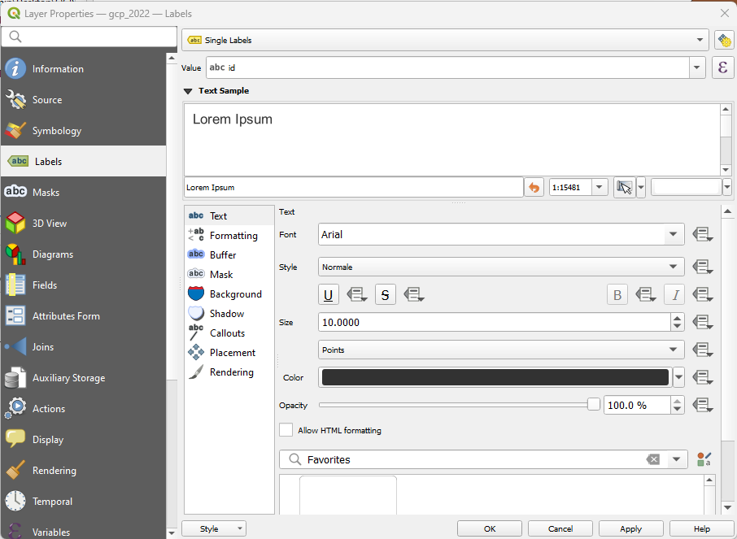

## Attribute table

The so-called **attribute table** associated to each layer loaded in our QGIS project contains all the thematic information associated to the single objects. Each row of it represents a different object (*feature*) while each column represents an attribute. Such structure is essential to manage the infoormation linked to the object on the project, as well as to select or query them efficiently.

To access the attribute table view, simply right click on the layer of interest and click on ***Open Attribute Table***.

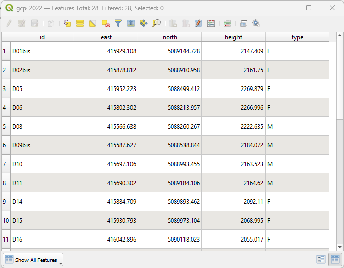

## Save a layer

During the various processing operations executed in a GIS environment, it is often very useful to save in new layers intermediate products as well as final outputs. In order to save a modified layer already loaded in a project, right-click on it and select ***Export*** > ***Save Features as***.

In the newly appeared window, select the desired output file format ad the file name path where you'd like to save your new layer. Then click okay for finalising the operation. Try to do this operation with the *gcp_2022* layer (originally available only as csv) and save it as a shapefile.

## Joins

[...]

## Editing mode

[...]

Click ***Toggle editing mode*** (1) → select the row associated to the municipality to be removed (it will be highlighted in light blue) (2) → click ***Delete selected features*** (3).

The removal of the selected record(s) will be completed only after clicking ***Save edits*** (4) and exiting the editing mode by clicking one more time ***Toggle editing mode*** (5).

[IMG]

[...]]

[IMG]

### Adding a new field

[...]

***Right click on the layer→ Open Attribute Table→ Toggle editing mode→ New field***

Define the required fields, paying particular attention to the **type of value** that will be entered in the new field (integer, decimal, text, date, etc.) and the **maximum number** of characters.

To finalise the changes introduced on the attribute table, save and end the editing session.

### Field calculator

***Right click on the layer→ Open Attribute Table→ Toggle editing mode→ Open field calculator***

[IMG]

Using the **field calculator** it is possible to create a new field containing the result of a pre-defined function or update with the results an existing field.

The unit of measurement of the result is defined by the reference system of the layer (in this case meters).

[IMG]

To finalize changes, save and end the editing session.

### Delete field

***Right click on the layer→ Open Attribute Table→ Toggle editing mode→ Delete field***

[IMG]

Select the field of interest and confirm the removal.

To finalize changes, save and end the editing session.

## Selection operations

[...]

### Select by expression

[...]

### Select by location

[...]
