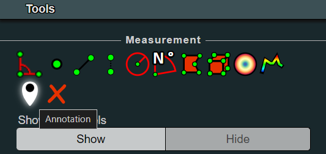
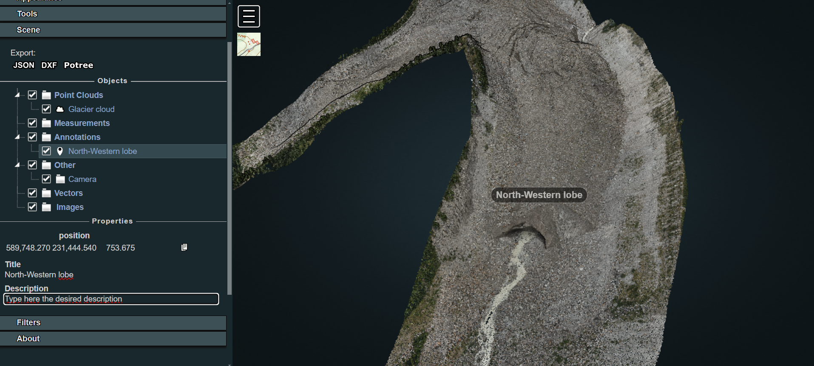
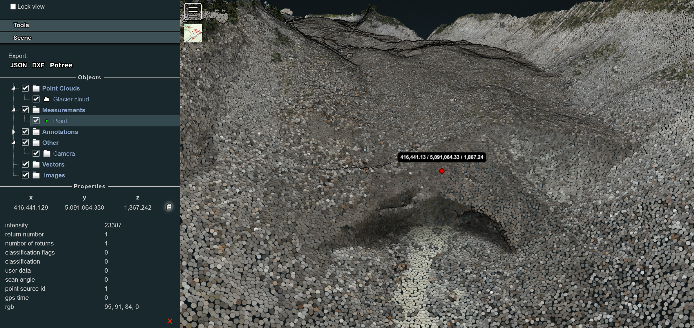
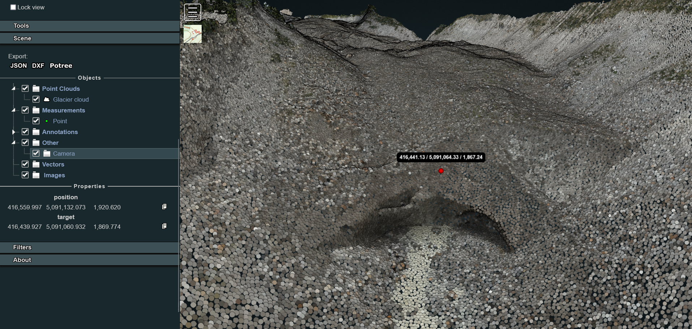

# Customise the viewer

Once loaded the point cloud in the Web Viewer as described [here](./web-viewer.md), it is possible to add custom functionalities, enriching the 3D scene with additional entities that could support both environment exploration and project storytelling. In particular, we will see example on how to include:
1. Georeferenced annotations
2. Drone images oriented on the pointcloud

## Inserting annotations

Adding custom annotations is particularly useful if it is needed to highlights particular position of the scene (measurement stations, base camp location) or if it is necessary to integrate actions or media. Indeed, having a simple familiarity with HTML code, it is possible to further customise the description label associated to an annotation.

Generally, in a normal exploration session of the viewer, users can add georeferenced position by simply clicking the annotation icon on the Potree sidebar on the *Tools > Measurement* section.



Once clicked, it is necessary to navigate in the viewer, look for the desired perspective on the scene and then right-click again on the point where you'd like to position the annotation. A black label with the text *Annotation Title* will then be added to the scene. The new element will also be visile in the *Scene > Annotations* section in the sidebar. By clicking on it there, in the *Properties* it will be possible to type the desired Title and Description.



This solution represents the easiest way to include annotations but it is temporary: when the user refreshes the page, reloading the content of the Potree page, the annotations inserted during that session will disappear.

If the aim is to insert permanently some annotations in the scene, it is needed to code them inside the source. To achieve this, create a new file named *annotations.js* inside the js folder. Then call it inside the *index.html* structure:

```
<body>
...
<!-- Import ANNOTATIONS-->
<script src="js/annotations.js"></script>
</body>
```

Now, let's define some annotations inside the *annotations.js* file with the help of the viewer. With *localhost/belvedere-example* open, navigate in the viewer and position yourself with the perspective you'd like to have when you click on a given annotation. For example, let's try to configure the annotation described earlier in the code.

Before working on the code, explore the point cloud in the viewer, activate the **Point Measurement Tool** and double-click in correspondence of the point where you'd like to locate the annotation. Hence, explore the Scene section in the Potree Sidebar and select the point measurement element. In the lower part of the section now you see the details of the measurement as well as the clicked point coordinates. Click on the copy icon next to the coordinates values: you will need this data to position your new annotation.



Hence, to complete the procedure, you need to define the camera view to be set when the annotation is clicked in Potree. In order to do this, rotate and move the model view and look for the desired perspective. Then, in the scene section of the sidebar, click on Camera: you will make visible a new Properties panel in which the coordinates linked to the camera position and camera target location that defines the actual view in the scene will be displayed.



Then, open the *annotations.js* in your preferred text editor. Copy and paste the following JS code:

```
/* Annotations definition */
function createAnnotation(scene, titleText, position, cameraPosition, cameraTarget, description) {
    // Create title element
    let titleElement = $(`<span>${titleText}</span>`);
    // Create Potree.Annotation instance
    let annotation = new Potree.Annotation({
        position: position,
        title: titleElement,
        cameraPosition: cameraPosition,
        cameraTarget: cameraTarget,
        description: description
    });
    // Set the annotation to be visible
    annotation.visible = true;
    // Add the annotation to the scene
    scene.annotations.add(annotation);
    // Override toString method for title element
    titleElement.toString = () => titleText;
}
```

This code snippet defines a function that creates an annotation with a specified title, position, camera settings, and description and adds it to a 3D scene using the Potree library.
Given such definition, a new annotation can be finally created, using the info collected through the viewer and copying and pasting them in the correct rows.

```
...
// Annotation example 1
createAnnotation(
    scene,
    "North-western lobe",
    [416441.129, 5091064.330, 1867.242], //Pasted from the Point Measurement Tool
    [416559.997, 5091132.073, 1920.620], //Pasted from the camera object (position)
    [416439.927, 5091060.932, 1869.774], //Pasted from the camera object (target)
    'This is the glacier section we surveyed with a terrestrial laser scanner as well as with UAVs'
)
```

Once saved, such an edit will allows to easily view and access the defined annotation at each new session. If additional annotations are needed, simply copy and paste the last code snippet, changing title and coordinates according to the case study needs.

## Inserting oriented images

[...]

**[..UNDER CONSTRUCTION..]**