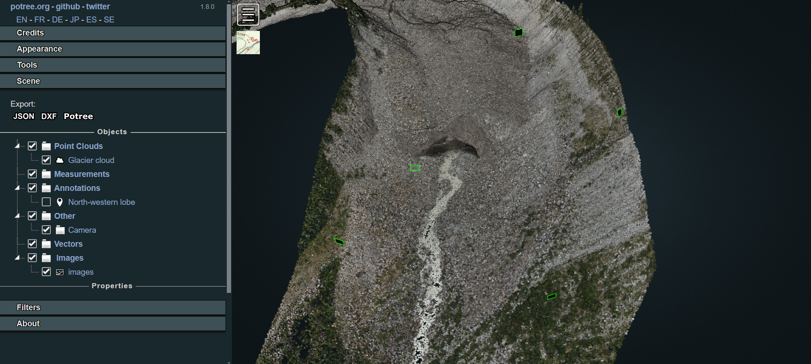
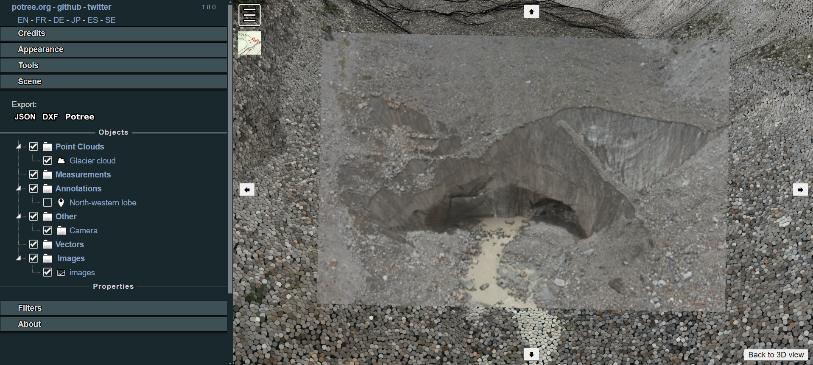

# Customise the viewer

Once loaded the point cloud in the Web Viewer as described [here](./web-viewer.md), it is possible to add custom functionalities, enriching the 3D scene with additional entities that could support both environment exploration and project storytelling. In particular, we will see example on how to include:
1. Georeferenced annotations
2. Drone images oriented on the pointcloud

## Inserting annotations

Adding custom annotations is particularly useful if it is needed to highlights particular position of the scene (measurement stations, base camp location) or if it is necessary to integrate actions or media. Indeed, having a simple familiarity with HTML code, it is possible to further customise the description label associated to an annotation.

Generally, in a normal exploration session of the viewer, users can add georeferenced position by simply clicking the annotation icon on the Potree sidebar on the *Tools > Measurement* section.


Once clicked, it is necessary to navigate in the viewer, look for the desired perspective on the scene and then right-click again on the point where you'd like to position the annotation. A black label with the text *Annotation Title* will then be added to the scene. The new element will also be visile in the *Scene > Annotations* section in the sidebar. By clicking on it there, in the *Properties* it will be possible to type the desired Title and Description.


This solution represents the easiest way to include annotations but it is temporary: when the user refreshes the page, reloading the content of the Potree page, the annotations inserted during that session will disappear.

If the aim is to insert permanently some annotations in the scene, it is needed to code them inside the source. To achieve this, create a new file named *annotations.js* inside the js folder. Then call it inside the *index.html* structure:

```
<body>
...
<!-- Import ANNOTATIONS-->
<script src="js/annotations.js"></script>
</body>
```

Now, let's define some annotations inside the *annotations.js* file with the help of the viewer. With *localhost/belvedere-example* open, navigate in the viewer and position yourself with the perspective you'd like to have when you click on a given annotation. For example, let's try to configure the annotation described earlier in the code.

Before working on the code, explore the point cloud in the viewer, activate the **Point Measurement Tool** and double-click in correspondence of the point where you'd like to locate the annotation. Hence, explore the Scene section in the Potree Sidebar and select the point measurement element. In the lower part of the section now you see the details of the measurement as well as the clicked point coordinates. Click on the copy icon next to the coordinates values: you will need this data to position your new annotation.


Hence, to complete the procedure, you need to define the camera view to be set when the annotation is clicked in Potree. In order to do this, rotate and move the model view and look for the desired perspective. Then, in the scene section of the sidebar, click on Camera: you will make visible a new Properties panel in which the coordinates linked to the camera position and camera target location that defines the actual view in the scene will be displayed.


Then, open the *annotations.js* in your preferred text editor. Copy and paste the following JS code:

```
/* Annotations definition */
function createAnnotation(scene, titleText, position, cameraPosition, cameraTarget, description) {
    // Create title element
    let titleElement = $(`<span>${titleText}</span>`);
    // Create Potree.Annotation instance
    let annotation = new Potree.Annotation({
        position: position,
        title: titleElement,
        cameraPosition: cameraPosition,
        cameraTarget: cameraTarget,
        description: description
    });
    // Set the annotation to be visible
    annotation.visible = true;
    // Add the annotation to the scene
    scene.annotations.add(annotation);
    // Override toString method for title element
    titleElement.toString = () => titleText;
}
```

This code snippet defines a function that creates an annotation with a specified title, position, camera settings, and description and adds it to a 3D scene using the Potree library.
Given such definition, a new annotation can be finally created, using the info collected through the viewer and copying and pasting them in the correct rows.

```
...
// Annotation example 1
createAnnotation(
    scene,
    "North-western lobe",
    [416441.129, 5091064.330, 1867.242], //Pasted from the Point Measurement Tool
    [416559.997, 5091132.073, 1920.620], //Pasted from the camera object (position)
    [416439.927, 5091060.932, 1869.774], //Pasted from the camera object (target)
    'This is the glacier section we surveyed with a terrestrial laser scanner as well as with UAVs'
)
```

Once saved, such an edit will allows to easily view and access the defined annotation at each new session. If additional annotations are needed, simply copy and paste the last code snippet, changing title and coordinates according to the case study needs.

## Inserting oriented images

Once loaded the point cloud in the Web Viewer, it is also possible to include in the Viewer oriented cameras. This is particularly useful for showing particular portions of the site and highlighting details on pictures taken from the drone and used for the reconstruction of the 3D model.

In order to load the images in the viewer platform, first copy and paste in the **img_selected** the folder containing:

* *Oriented images files*: they could be in any desired file formats: jpg, tif etc. Be sure that images are undistorted.

* *calib.xml*: this file includes information on the parameters of the camera adopted for taking the pictures used for the photogrammetric reconstruction. Be sure that *width* and *height* values match the ones of the chosen pictures. All the other parameters are set to 0 except the focal length. For example:

```
<?xml version="1.0" encoding="UTF-8"?>
<calibration>
  <projection>frame</projection>
  <width>8192</width>
  <height>5460</height>
  <f>8215.93777</f>
  <cx>0</cx>
  <cy>0</cy>
  <b1>0</b1>
  <b2>0</b2>
  <k1>0</k1>
  <k2>0</k2>
  <k3>0</k3>
  <date>2022-05-26T08:27:27Z</date>
</calibration>
```

* *cameras_eo.txt*: this file in the first row contains the information about the coordinate system in which the images and the model have been georeferenced. Then, information about position and rotation of each single image file are listed associated to the filenames. Be sure that rotation angles are defined as Omega, Phi and Kappa. Example:

```
# CoordinateSystem: PROJCS["WGS 84 / UTM zone 32N",GEOGCS["WGS 84",DATUM["World Geodetic System 1984",SPHEROID["WGS 84",6378137,298.257223563,AUTHORITY["EPSG","7030"]],TOWGS84[0,0,0,0,0,0,0],AUTHORITY["EPSG","6326"]],PRIMEM["Greenwich",0,AUTHORITY["EPSG","8901"]],UNIT["degree",0.01745329251994328,AUTHORITY["EPSG","9102"]],AUTHORITY["EPSG","4326"]],PROJECTION["Transverse_Mercator",AUTHORITY["EPSG","9807"]],PARAMETER["latitude_of_origin",0],PARAMETER["central_meridian",9],PARAMETER["scale_factor",0.9996],PARAMETER["false_easting",500000],PARAMETER["false_northing",0],UNIT["metre",1,AUTHORITY["EPSG","9001"]],AUTHORITY["EPSG","32632"]]
#Label X Y Z Omega Phi Kappa X_est Y_est Z_est Omega_est Phi_est Kappa_est
DJI_20221123144400_0268.jpg       593656.566250 5089108.835697 909.422444 69.797275 -11.168079 -4.525146
DJI_20221123144407_0271.jpg       593656.275265 5089107.376767 908.167646 76.005119 -11.476563 -3.278955
DJI_20221123144437_0284.jpg       593667.208196 5089110.605787 904.912258 116.932215 51.336722 -22.059546
DJI_20221123142343_0084.jpg       593661.475374 5089132.074970 917.423793 -52.683726 25.008452 161.764827
```

Once the files are copied in the target folder - in this example *img_selected* - it's time to create and modify the dedicated *orientedcameras.js* file in the js folder according to the need of the case.

In the first lines of the script it is needed to declare the paths of both the camera parameters and oriented images files.

Then, the *OrientedImageLoader* function is applied and the images chunk is added to the scene. A useful tip could be defining also an *images.name* associated to the loaded chunk: this will help if advanced functions for hiding specific images or elements are later implemented in the template.

```
/* Loading oriented images chunks */
/* First chunk of images */
/* Setting the paths for camera parameters and images list */
const cameraParams1 = "img-selected/calib.xml";
const imageParams1 = "img-selected/cameras_eo.txt";

Potree.OrientedImageLoader.load(cameraParams1, imageParams1, viewer).then(images => {
    images.visible = true; // change this to false if you'd like to hide images at first loading of the page
    viewer.scene.addOrientedImages(images);
    images.name = 'chunk1';
});
```

If you'd like to define another oriented images chunk, copy the entire code block of the first chunk and paste it right in first row below it in the js script. Then modify it according to your needs.

N.B.: Variable and constant names should be unique!

Now, refreshing the viewer page results in displaying several small black rectangles bordered in green, one for each oriented image inserted in the scene. Their position and orientation in space are based on the parameters passed through the *images_eo.tc* file. Also, if the oriented images integration has been successfull, you should be able to see in the Sidebar > Scene section a new *images* entity in the list.



When clicking on one of the rectangles, the user will enter the picture visualisation mode, accessing the selected oriented images aligned to the point clouds. This means that not only it is possible to analyse in high resolution the images that originated the cloud through the photogrammetric reconstruction, but also to execute measurements with the support of the image and reproject them in 3D on the point cloud.

