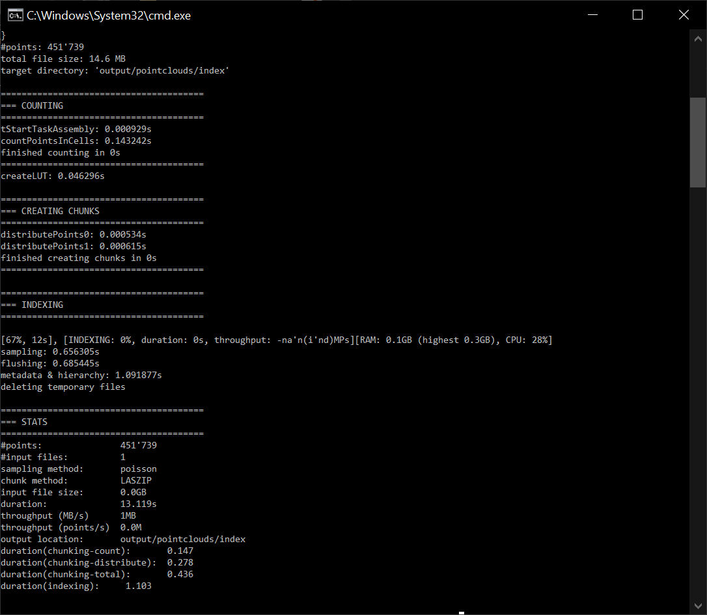

# Introduction

**Potree** is a free open-source WebGL based point cloud renderer for large point clouds, developed at the Institute of Computer Graphics and Algorithms, TU Wien, Austria.
There are 3 ways for accessing Potree:

* **Potree Desktop**: Desktop version of Potree. Allows drag&drop of point clouds into the viewer (https://github.com/potree/PotreeDesktop/releases)

* **Potree Converter**: Convert your point cloud to the Potree format (https://github.com/potree/PotreeConverter/releases)

* **Potree Develop**: Edit and develop several potree examples (https://github.com/potree/potree/)

## Potree Desktop

A desktop/portable version of the web-based point cloud viewer Potree, thanks to Electron. This versione allows you to load converted point clouds from your hard disk or external drive. It’s also portable, so you can put your models together with the viewer on a USB drive and open it wherever you go. It’s only been tested on Windows at the moment. It may not work on other systems or you may only be able to use it on the same Operating System that you’ve initially built it on. You can also drag&drop cloud.js files into the window to add point clouds to the scene.

### Installation

Download the Potree ,zip files for Windows from this link: https://github.com/potree/PotreeDesktop/releases

### Graphic User Interface

Once you downloaded the installer .zip, extract all the files and execute PotreeDesktop.bat. Then, a new window will appear with the main Graphic User Interface of Potree.

The Potree GUI is made of 2 components:

* **Sidebar**: on the left, it includes all the main features and tools for point-clouds elaborations in the Potree environment.

* **Viewer**: on the right, it is the actual space for visually exploring and navigating the point-clouds.

### Pointcloud Conversion

PotreeDesktop provides also a user-friendly interface for converting pointclouds in a Potree-compatible format. In order to do this, you can simply drag&drop the desired poincloud file (in a .las/.laz format) inside the viewer window. In a new window, after checking that the output target folder and the input files directory are defined as desired, it is required to select the PotreeConverter version to be adopted for the processing. Version 2.0 is the suggested one, generating only 3 files instead of thousands to millions. Click on the Start Conversion button to continue.

After the processing, the pointcloud is loaded in the viewer and the converted files are available in the previously defined output target directory.

## Potree Converter

PotreeConverter generates an octree LOD structure for streaming and real-time rendering of massive point clouds. The results can be viewed in web browser with Potree. The conversion operation produces a total of 3 files, with better support for standard LAS attributes and arbitrary extra attributes.

### Getting started

Download and extract the PotreeConverter files for Windwos from this link: https://github.com/potree/PotreeConverter/releases

Be sure that the PotreeConverter.exe is present inside the unzipped folder.

For making easier the conversion process, it is suggested to copy and paste in the unzipped PotreeConverter folder the pointcloud to be converted in a .las/.laz format.

*For Windows users:*

For starting the conversion, you can write “cmd” in File Explorer Address Bar and press enter. The cmd shell will be opened having as referenced directory the PotreeConverter folder. In order to trigger the conversion, modify the following code according to your needs and then paste it in the cmd shell:

` .\PotreeConverter.exe pointcloud.las -o output -p index `

Where:

* PotreeConverter.exe specify the executable file for the convertion;

* pointcloud.las select the point cloud (las or laz) to be converter. This format is valid in case the point cloud file is located in the same folder of the converter exe. Otherwise it is necessary to specify the complete path of the file;

* output is the name of the directory where to save the converted point cloud. In this case too, if the target folder is outside the converter one, it is necessary to specify the entire path.

* index is the default name to be given to the output file.

After launching, the conversion is executed and details about each step of the the processing are reported on the cmd shell window.

If successful, the conversion procedure gives as output a folder named as defined in the command (in this case output) containing 3 elements:

1. a folder named libs that contains all the required libraries and scripts to make Potree operative (e.g. *three.js, openlayers*…);

2. a folder named pointclouds containing an index directory that collects that 4 files resulting from the conversion of the original pointclouds. The *metadata.json* is the file called in the Potree environment when loading the pointcloud to the scene;

3. an html file called index.html that includes a basic structure for a web page with a Potree viewer.

## Potree Develop

For more details about the codes and libraries on which Potree is built, it is recommended to check the official Github repository: https://github.com/potree/potree. Many examples on how to implement Potree functionalities and customize them are available on the example folder with formatted html files dedicated to each case.